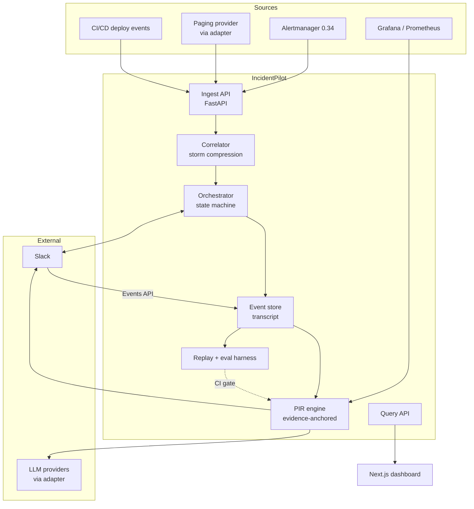
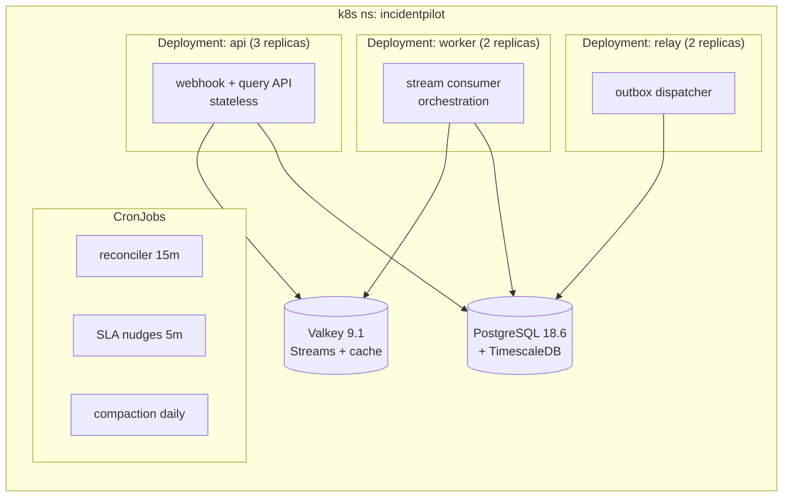
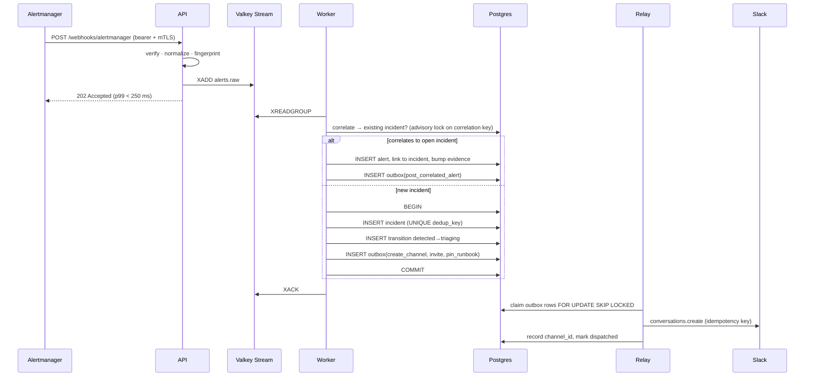
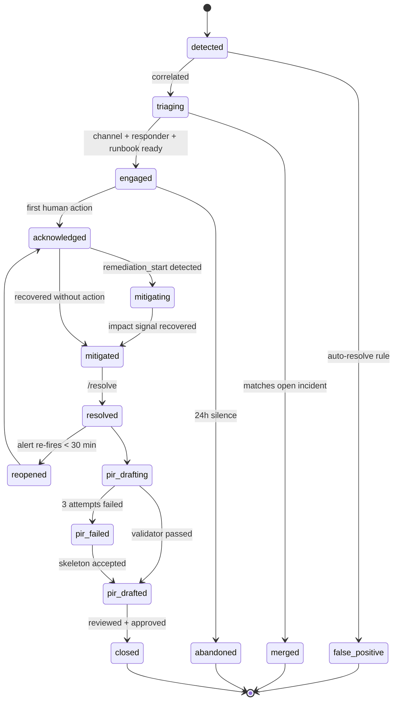
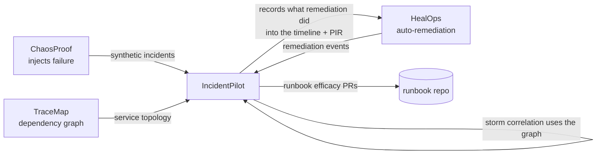

# IncidentPilot — Implementation Plan **Rev 2**

### Incident Management Automation Platform · Junior SRE Capstone · Verified 5 September 2026

> **What changed from Rev 1 (the 2,161-line plan you uploaded):**
> Rev 1 is structurally complete against your brief — every requested artifact is present in some form. Rev 2 does four things:
> 1. **§A** audits Rev 1 line-by-line against your 20-point brief (what's there, what's thin, what's missing).
> 2. **§B** documents **14 defects**, three of which are *architecture-breaking* under the 2026 Slack API rules. Rev 1's PIR pipeline **cannot work as written** on a Slack app created today. This is the single most important change in the document.
> 3. **§C/§D** re-pin every version against upstream releases checked today, and settle the "GPT-4 vs GPT-5" question — the answer is neither, and the reasoning is the interview answer.
> 4. **§9** adds **nine differentiators** designed against a market that changed radically: Netflix Dispatch was archived Sept 2025, Grafana OnCall OSS was archived 24 March 2026. The strongest self-hosted incident tools in the world are now read-only repos. That is the opening line of your pitch.
>
> **Reading order if you're short on time:** §B (defects) → §D (model decision) → §9 (differentiators) → §20 (interview prep). Everything else is reference.

---

## Table of Contents

**Part I — Audit & Corrections**
- §A. Completeness audit against your brief
- §B. Defects in Rev 1 (14 findings, severity-ranked)
- §C. Version matrix — verified 5 Sep 2026
- §D. The model decision: GPT-4, GPT-5, or neither

**Part II — The Plan**
- §1. Product definition, scope, and the bot's own SLOs
- §2. MVP blueprint — 8 weeks, with acceptance gates
- §3. Tech stack + why NOT the alternatives
- §4. High-Level Design
- §5. Low-Level Design (repo tree + core code)
- §6. Database design, DDL, and the choice matrix
- §7. Cache & messaging: Redis vs Kafka vs RabbitMQ vs ZooKeeper
- §8. Design patterns catalogue

**Part III — Differentiation**
- §9. Nine differentiators that beat the remaining OSS field
- §10. The MLOps wrapper + eval harness that gates CI

**Part IV — Operations**
- §11. Resilience patterns + FMEA
- §12. Availability & consistency patterns
- §13. Docker, Kubernetes, Helm + the documented scaling decision
- §14. CI/CD pipelines (complete workflows)
- §15. Observability and self-monitoring
- §16. Security, privacy, and the data boundary
- §17. Deployment strategy, public demo, cost
- §18. Testing strategy
- §19. README and screenshot checklist

**Part V — Career**
- §20. Interview prep: Q&A, soundbites, resume bullets
- §21. Roadmap and risk register
- §22. Portfolio integration and next deliverables

---

# Part I — Audit & Corrections

## §A. Completeness audit against your brief

Your brief asked for 20 named artifacts plus "differentiator features." Rev 1's coverage:

| # | Requested artifact | Rev 1 status | Verdict | Rev 2 location |
|---|---|---|---|---|
| 1 | Tech Stack | §2, table of 15 layers with justification | ✅ Present, **versions stale** | §3 |
| 2 | MVP Blueprint | §3, 7-week plan, day-by-day | ✅ Strong | §2 (extended to 8 weeks + acceptance gates) |
| 3 | Detailed System Design | §5 LLD, project tree + PIR pipeline code | ⚠️ Partial — tree is complete, only 2 modules have real code | §5 |
| 4 | Detailed System Architecture | §4, ASCII diagram + flows | ✅ Present, ASCII-only (no renderable diagram) | §4 (Mermaid, GitHub-renderable) |
| 5 | Detailed Database Design | §6.2, 6 tables + 1 hypertable | ⚠️ Present but **defective** (see B-04, B-05, B-06) | §6 |
| 6 | Database Choice | §6.1 matrix, 4 candidates | ⚠️ Missing CosmosDB + ClickHouse; volume math wrong | §6.7 |
| 7 | Cache & Messaging | §7, 6 Redis purposes | ⚠️ Missing ZooKeeper (you asked); no consumer-group design | §7 |
| 8 | Design Patterns | §8, 7 patterns with code | ✅ Strong | §8 (expanded to 14) |
| 9 | Docker & K8s | §11, compose + values.yaml | ⚠️ Thin — no Dockerfile, no manifests, `latest` tags | §13 |
| 10 | DevOps/MLOps wrapper | §10, prompt versioning + cost tracking | ⚠️ **No eval harness, no CI gate** — your standing requirement | §10 |
| 11 | High Level Design | §4 | ✅ | §4 |
| 12 | Low Level Design | §5 | ⚠️ See #3 | §5 |
| 13 | Resilience patterns | §9.1, 7 patterns | ✅ Named, not implemented | §11 |
| 14 | Mitigation strategies | §9.2, 5 scenarios | ✅ Good | §11.2 (extended to FMEA, 18 modes) |
| 15 | Availability & Consistency patterns | — | ❌ **Absent** | §12 |
| 16 | Deployment strategies | §11 + §15 checklist | ⚠️ No blue/green vs canary discussion, no rollback | §17 |
| 17 | Interview prep | §14, 11 Q&A | ✅ Good | §20 (28 Q&A + whiteboard scripts) |
| 18 | README + arch diagram + screenshots | §15 checklist line item | ⚠️ Mentioned, not specified | §19 |
| 19 | CI/CD (Actions → registry → host) | §12 | ⚠️ Present but **broken** (see B-11) | §14 |
| 20 | docker-compose + dashboard + scaling decision + live link | §11.1, §13 | ✅ All four present | §13.4, §17 |
| ★ | Differentiators that beat existing OSS | — | ❌ **Absent** — Rev 1 rejects Rootly/incident.io but never positions against OSS | §9 |

**Bottom line:** Rev 1 is a good plan with an outdated stack, a broken data-acquisition assumption, and no differentiation strategy. Sections 15 and ★ are the true gaps; everything else is repair work.

---

## §B. Defects in Rev 1

Ranked by what an interviewer would catch, and in what order they'd catch it.

---

### B-01 — 🔴 **CRITICAL: The PIR pipeline cannot fetch the Slack thread**

**Rev 1 says** (§5.2, Step 3a): *"Fetch all messages from channel via Slack API"* at resolve time, then feed them to the model.

**Reality, as of 3 March 2026:** Slack reduced `conversations.history` and `conversations.replies` to **1 request per minute, maximum 15 messages per request** for any app not approved for the Slack Marketplace. <cite index="57-1">The maximum and default values for the limit parameter have both been reduced to 15 objects, and for Marketplace and internal customer-built applications the method retains Tier 3 limits.</cite> <cite index="58-1">Beginning 3 March 2026, existing installations of apps distributed outside the Marketplace are also subject to the new limits.</cite>

A 150-message incident thread therefore needs **10 requests over 10 minutes**. Your "PIR in 30 seconds" demo dies on stage. Worse, <cite index="55-1">the failure mode is silent — no error, the app simply knows less than it used to.</cite>

**Fix — and this is a *better* architecture, not a workaround:**

> **Never read history. Never lose it in the first place.**

Subscribe to the `message.channels` Events API and persist every message to `slack_messages` **as it arrives**, in the same transaction that emits the timeline event. `conversations.replies` is then used *only* as a nightly reconciliation backstop over a 15-message window, never on the critical path. The PIR pipeline reads from your own database, not from Slack.

This converts a rate-limit problem into an **event-sourcing** design decision, and it is one of the strongest things you can say in an interview:

> "Slack throttled history reads to 15 messages a minute in March 2026 to stop bulk export into LLMs. Most incident bots built before that quietly broke. Mine reads nothing — it's event-sourced from the moment the channel is created, so the transcript is already in Postgres before anyone types `/resolve`. The Slack API is a write path for me, not a read path."

**Second-order consequences you must handle** (all covered in §5.4):
- Message edits (`message_changed`) and deletes (`message_deleted`) must be applied as events — your store is now the system of record, so it has to stay honest.
- Events API delivery is at-least-once → dedup on `(channel_id, ts)` with a unique constraint.
- If your app misses events during a deploy, the reconciliation job backfills within the 15/min budget.
- Note the scope split: `conversations.replies` on public channels **requires a user token** with `channels:history`; bot tokens only work for DMs. Another reason not to depend on it.

---

### B-02 — 🔴 **CRITICAL: Alertmanager webhooks cannot be signature-validated**

**Rev 1 says** (§4, Webhook Layer): *"Signature validation, rate limiting, dedup"* — applied uniformly to all three webhook sources.

**Reality:** Prometheus Alertmanager **does not sign its webhook payloads**. There is no HMAC header. `http_config` supports basic auth, bearer tokens, OAuth2, and TLS — nothing more. Claiming signature validation on that endpoint in an interview is an instant credibility loss, because the interviewer has configured Alertmanager and knows.

**Fix — per-source authentication, documented as a table:**

| Source | Mechanism | Implementation |
|---|---|---|
| Alertmanager | Bearer token in `http_config.authorization` + mTLS + NetworkPolicy IP allowlist | Constant-time compare; reject on any mismatch; 401 |
| PagerDuty | `X-PagerDuty-Signature` — HMAC-SHA256, `v1=` prefixed, **may carry multiple signatures during key rotation** — accept if *any* matches | Compare against all provided sigs |
| Slack | `X-Slack-Signature` v0 HMAC-SHA256 over `v0:{timestamp}:{raw_body}` + `X-Slack-Request-Timestamp` replay window ≤ 300 s | Must hash the **raw** body, before any JSON parsing |
| Grafana | Static bearer + allowlist | Same as Alertmanager |

The interview answer: *"Three sources, three trust models. Slack signs, PagerDuty signs with rotation support, Alertmanager doesn't sign at all — so that endpoint gets mTLS plus a bearer token plus a NetworkPolicy, because it's the one that can't prove who it is."*

---

### B-03 — 🔴 **CRITICAL: One alert storm = 40 Slack channels**

**Rev 1** creates one channel per firing alert, deduplicated only by fingerprint with a 10-minute TTL. A database failover fires `PostgresDown`, `HighErrorRate` on six services, `PodCrashLoop`, `LatencyP99High`, and `CertExpiry` — **all different fingerprints**. Rev 1 creates a channel for each.

Three failure modes at once:
1. **Human**: responders are split across 12 war rooms during one outage. This is worse than no bot.
2. **API**: `conversations.create` is Tier 2 (~20 req/min). A 40-alert storm hits the rate limit and channel creation — *the one thing that must never fail* — starts returning 429.
3. **Reputational**: this is exactly the failure everyone remembers, and it's the first thing an SRE interviewer will probe.

**Fix:** alert **correlation and storm compression** before channel creation — one incident, many alerts, with alerts attached to the existing incident as evidence. This is differentiator **D3** (§9.3) and it is the highest-value feature in the whole project.

---

### B-04 — 🟠 The TimescaleDB volume math is wrong, and the interviewer will do it

**Rev 1 claims:** *"During a busy incident, the bot collects ~50-200 events per minute … Over 30 days, this is potentially 1-5 million rows."*

Do the arithmetic the way a panel will:

```
30 incidents/day × 45 min average × 20 timeline events/min ≈ 27,000 events/day
27,000 × 30 days ≈ 810,000 rows/month
```

810 K rows is **not** a time-series problem. Plain PostgreSQL with a BRIN index answers `GROUP BY time_bucket, intent` over that in well under a second. The 50–200/min figure only reaches millions if it runs 24/7, which contradicts "10–50 incidents per day" three paragraphs earlier in the same section.

Do **not** walk into an interview with a self-contradicting justification. But the conclusion (use TimescaleDB) is still right — for different, defensible reasons:

**The honest justification (§6.4):**
1. The genuinely high-volume table is `signal_samples` — the metric snapshots you capture per incident for the PIR's impact section. 20 series × 1-second resolution × 60 minutes = **72,000 rows per incident**, ~2.2 M rows/month. *That* is a hypertable.
2. **Continuous aggregates** give you pre-computed MTTA/MTTR/alert-frequency rollups so the dashboard doesn't re-scan on every page load.
3. **Retention policies** (`add_retention_policy`) are declarative — the alternative is a cron job you have to write, monitor, and explain.
4. **`time_bucket_gapfill()`** renders the incident timeline chart correctly across gaps; plain SQL needs a `generate_series` LEFT JOIN.
5. **Columnar compression** on chunks older than 7 days, ~10× on the sample data.

And say the honest part out loud, because it's the strongest move available:

> "I'll be straight about this: timeline events alone were about 800 K rows a month — that doesn't justify TimescaleDB, and my first draft of this justification had the arithmetic wrong. What justifies it is the metric-sample table at 72,000 rows per incident, plus continuous aggregates and declarative retention. If I'd dropped the metric snapshots from scope, I'd have dropped TimescaleDB with them and used a BRIN index."

Volunteering a corrected estimate is a *stronger* signal than a clean one. Panels remember candidates who audit their own numbers.

---

### B-05 — 🟠 Compression `segmentby` is backwards

```sql
-- Rev 1
timescaledb.compress_segmentby = 'incident_id, intent'
```

`incident_id` is the **highest-cardinality column in the table**. Segmenting by it produces one tiny compressed batch per incident, which defeats columnar compression almost entirely — you can end up larger than uncompressed after per-batch overhead.

**Fix:** segment by the low-cardinality dimension, order by time.

```sql
ALTER TABLE timeline_events SET (
    timescaledb.compress,
    timescaledb.compress_segmentby = 'intent',
    timescaledb.compress_orderby   = 'incident_id, time DESC'
);
```

`incident_id` moves to `orderby`, which keeps per-incident reads fast (sparse min/max indexes prune batches) while giving compression long runs of identical `intent` values.

---

### B-06 — 🟠 `TIMESTAMP` instead of `TIMESTAMPTZ` in an incident system

Every relational table in Rev 1 uses naked `TIMESTAMP` (`started_at`, `resolved_at`, `acknowledged_at`) while the hypertable uses `TIMESTAMPTZ`. For a tool whose entire output is a **timeline**, with responders in IST, PT, and CET, this is a data-corruption bug waiting to happen — and it makes the two tables non-joinable on time without a cast.

**Fix:** `TIMESTAMPTZ` everywhere, `SET timezone = 'UTC'` on the pool, render in the responder's zone at the edge. One line in an interview: *"Everything is timestamptz and stored UTC; the only place a local timezone exists is the Slack render."*

---

### B-07 — 🟠 Redis `SETNX` dedup loses work on worker crash

```
Key: "alert:dedup:{fingerprint}" → 1 (TTL 600s)
On webhook: SET NX → if fails, skip processing
```

The key is set **before** the work completes. If the worker dies between claiming the fingerprint and creating the channel, the alert is silently dropped for 10 minutes — during an incident. Alertmanager will re-send on its `repeat_interval` (typically 4 h), so the practical outcome is *no war room at all*.

**Fix:** two-phase claim. Redis holds a short claim (60 s) that is **renewed** while work is in flight and **converted to a durable record** in Postgres on success; on failure the claim is explicitly released and the message is left un-ACKed in the stream so `XAUTOCLAIM` re-delivers it. Idempotency then comes from a `UNIQUE` constraint on `(dedup_key)` in `incidents` — the database, not the cache, is the arbiter. Cache-as-lock is an optimization; cache-as-truth is a bug.

---

### B-08 — 🟠 No outbox: orphaned Slack channels are guaranteed

The orchestrator calls Slack, then writes to Postgres. Crash between the two and you have a `#inc-…` channel that no incident row knows about — invisible to the dashboard, un-resolvable by `/resolve`, and it will sit in the workspace forever. At 30 incidents/day this happens weekly.

**Fix:** **transactional outbox**. Write the intent (`outbox_events`) in the same transaction as the state change; a relay worker performs the Slack call and marks it dispatched, keyed by an idempotency key so a retry re-uses the existing channel rather than creating a second one. Plus a nightly reconciler that lists `#inc-*` channels and archives any with no incident row. Covered in §5.6 and §12.3.

---

### B-09 — 🟡 Self-reported LLM confidence is not a safety mechanism

Rev 1 gates the fallback on `confidence_score < 0.5`, self-reported by the model in its own JSON output. A model that hallucinates a root cause will happily report 0.9 confidence about it. Self-reported confidence is **weakly calibrated and adversarially useless** — it correlates with fluency, not correctness.

**Fix:** replace vibes with a **verifiable invariant** — every factual claim in the PIR must carry a citation to a stored `slack_messages.id`, `timeline_events` row, deploy record, or metric window, and a deterministic validator rejects any output containing an uncited claim. That's differentiator **D1** (§9.1). Keep the self-reported score as *telemetry*, never as a *gate*.

---

### B-10 — 🟡 `users_affected_estimate` is a hallucinated business metric

Rev 1's PIR schema asks the model to produce `impact.users_affected_estimate`. The model has no access to your request logs. It will produce a plausible number, that number will go into a document titled "Post-Incident Review", and someone will put it in a board deck.

**Fix:** impact figures are **computed deterministically** from PromQL over the incident window (`sum(increase(http_requests_total{status=~"5..'"}[window]))`, affected-pod count, error-budget burn) and *injected into* the prompt as ground truth. The model narrates numbers; it never invents them. This split — **deterministic facts, generated prose** — is the core governance idea of the whole project.

---

### B-11 — 🟡 The CI prompt-regression job never runs

```yaml
if: contains(github.event.head_commit.modified, 'prompt_templates/')
```

`github.event.head_commit.modified` is only populated on `push` events, is absent on `pull_request`, and is a list — `contains()` on a list tests for *exact element equality*, not substring. This condition is `false` essentially always, so the eval job silently never executes. A quality gate that never runs is worse than no gate, because you believe you have one.

**Fix:** `on.pull_request.paths` filters, or `dorny/paths-filter@v3` for multi-job routing. Full corrected workflow in §14.

---

### B-12 — 🟡 Slack rate-limit tiers are described backwards

Rev 1: *"Slack has tier-based rate limits (~100 calls/min for Tier 1)."* It's the inverse — **Tier 1 is the most restrictive** (~1+/min); Tier 4 is ~100+/min. And the method that actually matters here, `chat.postMessage`, has its own **~1 message per second per channel** allowance with short bursts. The live-updating timer in Rev 1 (`chat.update` every 5 minutes across N active incidents) plus timeline reactions can push you into 429s exactly when you're busiest.

**Fix:** per-method, per-channel token buckets in Redis, with a **priority lane** — channel creation and responder paging preempt timer refreshes and emoji reactions. §7.3.

---

### B-13 — 🟡 The state machine has no escape hatches

Rev 1's `VALID_TRANSITIONS` is a straight line with one retry edge. Real incidents need: **false positive** (auto-resolve, no PIR), **merge** into a parent incident (storm compression requires this), **re-open** after a premature resolve, **escalate severity mid-incident**, **PIR permanently failed** (human writes it), and **abandoned** (channel went quiet for 24 h). Also, `acknowledged_at` exists in the schema with no corresponding state — so your headline TTA metric isn't backed by a transition anywhere in the machine.

**Fix:** 13-state machine with explicit terminal branches, DB-enforced (§5.3, §6.2).

---

### B-14 — 🟡 Version drift and non-reproducible builds

| Rev 1 | Problem |
|---|---|
| Python 3.12 | Two feature releases behind; 3.14 is current |
| PostgreSQL 16 | 18.6 is current; 16 loses features you're using |
| Redis 7 | Licence changed in 2024; Valkey 9.1 is the OSS-safe default |
| Next.js 14 / Node 20 | **Node 20 reached end-of-life April 2026** — shipping it is a security finding |
| `timescale/timescaledb:latest-pg16` | Floating tag → non-reproducible builds, silent breakage |
| `grafana/grafana:latest` | Same |
| `version: '3.8'` in compose | Obsolete key; Compose v2 warns on it |
| `gpt-4-turbo` in `values.yaml` | Hardcoded vendor+model — violates your provider-agnostic standard |
| `pip install -r requirements.txt` | No lockfile → non-reproducible CI |

All re-pinned in §C.

---

## §C. Version matrix — verified 5 September 2026

Every pin below was checked against the upstream release feed or package index **today**. Where your other capstones (HealOps, ChaosProof, TraceMap) already pin a version, I've kept portfolio consistency and flagged the two places where upstream has moved since those plans were written.

### C.1 Runtime and application

| Component | **Pin** | Verified | Why this pin |
|---|---|---|---|
| Python | **3.14.7** | 3.14.7 released 5 Aug 2026; 3.15 planned 1 Oct 2026 | Matches HealOps/ChaosProof/TraceMap. Do **not** jump to 3.15 mid-project — `litellm` and several SDKs cap at `<3.15` today |
| FastAPI | **0.141.1** | current on PyPI | Async webhooks, native Pydantic v2 |
| Pydantic | **2.13.5** | current | Structured-output validation for the PIR schema |
| pydantic-settings | **2.15.0** | current | 12-factor config, no hardcoded vendors |
| SQLAlchemy | **2.0.52** | current | 2.0 async ORM |
| Alembic | **1.19.2** | current | Migrations, including the hypertable conversion |
| psycopg | **3.3.5** (binary+pool) | current | **Changed from Rev 1's asyncpg** — psycopg3 handles `TIMESTAMPTZ`, pipelines, and pgbouncer transaction mode more predictably; asyncpg remains a valid alternative (§3.2) |
| redis-py | **8.1.0** | current | Streams, consumer groups, `XAUTOCLAIM` |
| slack-bolt | **1.30.0** | released 15 Jul 2026 | **Bumped from portfolio's 1.28.x** — 1.29/1.30 landed since HealOps was written |
| slack-sdk | **3.44.1** | current | Web API client under Bolt |
| openai | **3.8.0** | current | One adapter implementation, not the interface |
| anthropic | **1.4.0** | current | Second implementation — proves the adapter is real |
| httpx | **0.28.1** | current | Async HTTP for Grafana/PagerDuty/Prometheus |
| tenacity | **9.1.4** | current | Retry with jitter |
| pybreaker | **1.4.1** | current | Circuit breaker per dependency |
| structlog | **26.1.0** | current | JSON logs with `incident_id` bound |
| prometheus-client | **0.26.0** | current | Self-monitoring `/metrics` |
| opentelemetry-sdk | **1.44.0** | current | Traces across webhook → worker → LLM |
| arq | **0.28.0** | current | Scheduled jobs (nudges, SLA timers, reconciliation) |
| presidio-analyzer | **2.2.364** | current | PII detection at the LLM boundary (§16.3) |
| uvicorn | **0.52.4** | current | ASGI server (granian 2.8.2 is the faster alternative) |
| uv | **0.12.10** | current | **Replaces pip** — `uv.lock` gives reproducible CI |
| ruff / mypy | **0.16.6 / 2.3.1** | current | Lint + strict typing |
| pytest / pytest-asyncio | **9.1.1 / 1.4.0** | current | Note: pytest 9 removed several deprecated hooks |
| testcontainers | **4.15.0** | current | Real Postgres+Valkey in integration tests |

### C.2 Data and infrastructure

| Component | **Pin** | Verified | Notes |
|---|---|---|---|
| PostgreSQL | **18.6** | released 13 Aug 2026 | 18.5 was **never shipped** (regression) — do not reference it. PG19 is at beta 3; do not adopt until TimescaleDB supports it |
| TimescaleDB | **2.29.2** | released 18 Aug 2026 | Supports PG16/17/18; **2.29.0 dropped PG15**. 2.29.1 fixed three security advisories — do not pin below 2.29.1 |
| pgvector | **≥ 0.8** | — | Repeat-incident similarity (D8) |
| Valkey | **9.1.2** | released 1 Sep 2026 | Default cache/stream. Redis 8.x works identically for everything here; Valkey avoids the licence conversation entirely |
| Prometheus | **3.14.0** | released 18 Aug 2026 | Alert source + self-monitoring |
| Alertmanager | **0.34.0** | released 16 Aug 2026 | **Bumped from portfolio's 0.33.1.** One behaviour change: the `reason` label on `alertmanager_notifications_failed_total` now splits `authError` and `rateLimited` out of `clientError` — update any dashboard matching `reason="clientError"` |
| Grafana | **13.2.1** | current tag | Dashboards + render API for screenshots |
| OTel Collector (contrib) | **0.160.0** | released 2 Sep 2026 | Optional; matches TraceMap |
| Kubernetes | **1.36.4** demo, **1.35** floor | 1.37.0 is GA; 1.36.4 is the latest 1.36 patch | Kept at 1.36 for portfolio consistency with HealOps/ChaosProof. Mention 1.37 awareness in interviews |
| Helm | **4.2.4** | current stable (4.3.0-rc.1 exists) | Chart apiVersion v2 |
| Node.js | **24 LTS** | — | **Node 20 is EOL** — the dashboard must not ship on it |
| Next.js | **16.3** | — | Matches NaukriNearby/PRGraph/TraceMap dashboards |

### C.3 Container image pins (no `latest`, ever)

```yaml
timescale/timescaledb-ha:pg18.6-ts2.29.2   # NOT latest-pg16
valkey/valkey:9.1.2-alpine                  # NOT redis:7-alpine
prom/prometheus:v3.14.0
prom/alertmanager:v0.34.0
grafana/grafana:13.2.1                      # NOT latest
python:3.14.7-slim-trixie                   # bot base image
node:24-alpine                              # dashboard build stage
```

> **Interview line:** *"Every image is digest-pinnable and version-pinned. `latest` in a compose file means your reproduction of last Tuesday's bug is a different system than last Tuesday's."*

---

## §D. The model decision — GPT-4, GPT-5, or neither

You asked whether GPT-5 is better suited. Here is the current state, checked today, then the decision.

### D.1 What the market looks like in September 2026

<cite index="38-1">The GPT-4 / o-series models have been folded into the GPT-5 line and are now legacy.</cite> <cite index="39-1">The GPT-5.6 family (Sol, Terra, Luna) went GA on 9 July 2026 with a 1.05 M-token context window across all three tiers; on 30 July OpenAI cut Terra's price 20% and Luna's 80%.</cite> <cite index="33-1">At roughly $0.20/$1.20 per million tokens, Luna sits about 4× below GPT-5.4 Mini's $0.75/$4.50 while remaining in the current flagship family, and Terra at $2/$12 now undercuts the previous generation's standard model at $2.50/$15.</cite>

*(Published prices differ slightly between trackers — one lists Sol at $5/$30, another at $4/$20. Treat all figures as indicative and read them off the vendor's own pricing page before you quote a number in an interview.)*

### D.2 The decision

**Rev 1's `gpt-4-turbo` is wrong on three counts:** it's a legacy model, it's hardcoded in `values.yaml`, and it's a single tier doing three very different jobs.

**Rev 2 uses three named *roles*, resolved from config, never from code:**

| Role | Workload | Volume | Default tier | Why |
|---|---|---|---|---|
| `extract` | Message → intent classification, entity tagging, action-item candidate spotting | ~200–2,000 calls/day | **Small/cheap current-gen** (Luna-class) | High volume, short outputs, near-deterministic task. Paying flagship rates here is pure waste |
| `synthesize` | The PIR narrative: summary, contributing factors, what-went-well | **1 per incident** | **Mid-tier** (Terra-class) | Long context (whole transcript + metrics), quality is visible to humans, ~30/day makes cost irrelevant |
| `judge` | Offline eval scoring in CI only | ~40 per eval run | **Mid or flagship** | Never on the production path; quality matters more than latency |

```yaml
# config/models.yaml — the ONLY place a model name appears
roles:
  extract:
    provider: ${LLM_PROVIDER_EXTRACT:-openai}
    model:    ${LLM_MODEL_EXTRACT}       # e.g. a Luna-class small model
    max_output_tokens: 512
    temperature: 0.0
    timeout_s: 8
    budget_usd_per_incident: 0.05
  synthesize:
    provider: ${LLM_PROVIDER_SYNTH:-openai}
    model:    ${LLM_MODEL_SYNTH}         # e.g. a Terra-class mid model
    max_output_tokens: 4096
    temperature: 0.2
    timeout_s: 60
    budget_usd_per_incident: 0.40
  judge:
    provider: ${LLM_PROVIDER_JUDGE:-anthropic}
    model:    ${LLM_MODEL_JUDGE}
    offline_only: true
fallback_chain: [primary, secondary, deterministic_skeleton]
```

**⚠️ One flag against your standing baseline.** Your portfolio treats **GPT-5.4-mini as an established default**. That decision was sound when made, but Luna's 30 July price cut put a *current-generation* model roughly 4× below GPT-5.4-mini's rate. I have **not** silently changed your baseline — `config/models.yaml` ships with GPT-5.4-mini as the committed default so IncidentPilot stays consistent with your other projects. What I've added is the mechanism to settle it with evidence rather than opinion: run the §10 eval harness across both, compare F1 and cost per PIR, and **promote whichever wins on your own golden set**. If you'd rather flip the portfolio-wide default now, that's a one-line config change in every project — say the word and I'll do the sweep.

### D.3 The interview answer

> "I never pin a model in code. The system defines three roles — extract, synthesize, judge — and each resolves through an adapter from config. That mattered more than I expected: between starting the project and finishing it, the vendor shipped a new family and cut prices 80% on the small tier. My cost per PIR dropped by changing one YAML value, and the eval harness proved quality didn't regress before I merged it. If I'd written `gpt-4-turbo` in a values file, I'd have been rewriting code to chase a price change."

Follow-up they will ask — *"How do you know the cheaper model is good enough?"*:

> "I don't guess, I measure. Forty real incidents in a golden corpus, five metrics, and a CI gate: citation precision must stay at 1.0, timeline F1 can't drop more than 3 points against the committed baseline, and hallucinated-claim count must be zero. A model swap is a pull request that either passes that gate or doesn't merge."

---

# Part II — The Plan

## §1. Product definition, scope, and the bot's own SLOs

### 1.1 One-liner

IncidentPilot is a self-hosted incident-response platform that turns an alert into a fully staffed Slack war room in under 10 seconds, event-sources the entire response, and produces a **citation-anchored** Post-Incident Review in which every factual claim is traceable to a specific message, deploy, or metric window — with a replayable eval harness that gates every prompt and model change in CI.

### 1.2 The market gap (this is your opening line)

The two best self-hosted incident tools in the world are **gone**:

| Tool | Status |
|---|---|
| **Netflix Dispatch** | (cite index="41-1">Archived September 2025 — read-only, after Netflix walked away from it despite hundreds of engineers.</cite> |
| **Grafana OnCall OSS** | (cite index="48-1">Archived 24 March 2026; the repository is read-only and development moved to the paid Grafana Cloud IRM.</cite> (cite index="45-1">The OSS version also relied on Grafana Cloud as a push relay for SMS, phone, and push, and that connection was deprecated on the same date.</cite> |
| Remaining OSS | (cite index="41-1">Incidental (early, v0.1.0) and incident-bot are both MIT but much smaller projects than Dispatch or OnCall were; IncidentFox has an Apache-2.0 core but a BSL-1.1 production security layer requiring a commercial licence.</cite> |

> **The pitch:** *"Two of the three credible open-source incident platforms were archived within six months of each other, and the replacements are paid SaaS. I built the self-hosted alternative — and I built the parts they never had: evidence-anchored PIRs and an eval harness that gates prompt changes in CI."*

Verify this is still true the week of your interview — say "as of my last check in September 2026." Panels reward candidates who date their claims.

### 1.3 Scope

**In scope (MVP):** Alertmanager + PagerDuty ingestion · storm correlation · Slack channel orchestration · responder assignment with fatigue awareness · runbook matching and posting · event-sourced transcript · deterministic impact computation · evidence-anchored PIR generation · action-item lifecycle · Next.js analytics dashboard · Helm/K8s deployment · eval-gated CI.

**Explicitly out of scope (say this in interviews — scope discipline is a signal):**
- **Paging transport.** No SMS/voice/push. That is a pager, it needs carrier redundancy and its own on-call, and it is a different product. IncidentPilot *reads* the on-call schedule from a paging provider through an adapter.
- **Status pages.** Adjacent product, no shared primitives.
- **Automated remediation.** That is **HealOps** (your other capstone). IncidentPilot *observes* remediation; it doesn't perform it. Clean boundary, and it lets you talk about both.
- **Multi-tenancy.** Single workspace, single org. Multi-tenant is a 3-month tax with no interview payoff.

### 1.4 The bot's own SLOs — write these down before you write code

The single best signal you can send an SRE panel is that **you applied SRE practice to your own tool.** Most candidates build an SRE tool and never define its SLIs.

| SLI | Definition | SLO | Error budget (30 d) |
|---|---|---|---|
| **Ingest availability** | `1 - (5xx on /webhooks/* ÷ total)` | **99.9%** | 43 min |
| **Ingest latency** | p99 webhook ack | **< 250 ms** | — |
| **Time-to-war-room** | alert accepted → channel created + responder invited + runbook pinned | **p95 < 10 s** | — |
| **Responder notified** | alert accepted → responder DM delivered | **p95 < 30 s** | — |
| **Transcript completeness** | messages in store ÷ messages in channel (nightly reconcile) | **≥ 99.99%** | this is the one that matters — a lost message is a lost citation |
| **PIR delivery** | resolve → draft posted (any layer, including skeleton) | **99.5%, p95 < 90 s** | 3.6 h |
| **PIR grounding** | PIRs with zero uncited claims | **100%** — hard invariant | zero budget |
| **Cost per incident** | LLM spend ÷ incidents | **< $0.50** | budget breaker at 2× |

Two of these are unusual and both are deliberate talking points:

- **Transcript completeness is the real availability metric.** If the bot is up but dropped 3 messages, the PIR is wrong and nobody notices. Availability of a data-collection system is measured in data, not in HTTP 200s.
- **PIR grounding has a zero error budget.** Most SLOs are probabilistic; this one is an invariant, enforced by a deterministic validator, not a model. If it can't cite, it doesn't ship — it degrades to a skeleton.

**Alert on burn rate, not on thresholds:** multi-window multi-burn-rate (2%/1 h fast burn → page, 5%/6 h slow burn → ticket) per the Google SRE workbook. §15.3 has the rules.

---

## §2. MVP blueprint — 8 weeks with acceptance gates

Rev 1's 7 weeks was tight and had no gates. Rev 2 adds a week and, more importantly, a **binary acceptance test per week** — if it fails, you do not proceed. This mirrors how real delivery works and gives you a story about cutting scope under pressure.

### 2.1 Week-by-week

| Wk | Theme | Build | 🚦 Acceptance gate (binary) |
|---|---|---|---|
| **1** | Ingest & trust boundary | FastAPI skeleton, three webhook endpoints, per-source auth (§B-02), Redis Streams producer, `XADD` + consumer group, structured logging, `/healthz` `/readyz` `/metrics` | Fire an Alertmanager payload with a **bad** bearer → 401. Fire a good one → 202 in **< 250 ms p99** over 100 requests, and the event is visible via `XRANGE` |
| **2** | Correlation & state machine | Fingerprinting, dedup via Postgres unique constraint, **storm compression (D3)**, 13-state machine with DB-enforced transitions, outbox table | Replay a recorded 40-alert storm → **exactly 1 incident**, 39 alerts attached as evidence, and every invalid transition raises |
| **3** | Slack orchestration | Channel create/invite/pin, Block Kit builder, outbox relay with idempotency keys, priority rate limiter, timer | Kill the worker mid-orchestration (`docker kill`) → on restart, **no duplicate channel**, incident completes. This is your best demo of idempotency |
| **4** | Event-sourced transcript | `message.channels` subscription, `slack_messages` store, edit/delete handling, `(channel_id, ts)` uniqueness, reconciliation job, deterministic intent detection | Post 200 messages in a channel → **200 rows**, zero duplicates, zero calls to `conversations.history`. Assert the call count is 0 in the test |
| **5** | Responders & runbooks | Paging-provider adapter (PagerDuty impl), on-call cache, **fatigue-aware routing (D5)**, runbook matcher, 8 runbooks, `/resolve /update /escalate /metrics /falsepositive` | On-call lookup with the provider **unreachable** → falls back to cache, then to team channel, and posts a visible degradation notice. Never silently fails |
| **6** | Deterministic impact + PIR core | PromQL impact collector, `signal_samples` capture, evidence graph, LLM adapter, **evidence-anchored PIR (D1)**, citation validator, skeleton fallback | Generate a PIR with the **LLM provider blocked at the network level** → skeleton posted within 90 s, incident still reaches `pir_drafted`. Then unblock → full PIR, **zero uncited claims** |
| **7** | Replay harness + eval gate | Recorder/replayer (**D2**), 40-incident golden corpus, 5 eval metrics, CI gate, cost telemetry, budget breaker | Change one word in the prompt → CI **fails** on the eval gate and the PR is blocked. Screenshot this; it's a portfolio artifact |
| **8** | Dashboard, deploy, polish | Next.js 16.3 dashboard, Grafana self-monitoring dashboard, Helm chart, k3s deploy, README, demo recording, public URL | End-to-end demo runs **three times consecutively** without manual intervention. Public URL live |

**Buffer policy:** if you slip, cut in this order — dashboard analytics pages → runbooks 7–8 → fatigue routing → *never* cut the eval harness or citation validator, because those are the differentiators.

### 2.2 The demo script (rehearse this until it's 4 minutes)

```
0:00  "Every incident tool creates a channel. Watch what happens on an alert storm."
0:05  ./scripts/demo.sh storm --alerts 40 --service payments
0:12  → ONE channel appears: #inc-2026-09-05-payments-degraded
      → Pinned: "40 correlated alerts · root signal: postgres-primary · 6 services affected"
      → On-call invited; a second responder auto-added because the primary was
        paged twice in the last 8 hours (fatigue routing)
      → Runbook pinned, matched to the ROOT signal, not the loudest alert
0:45  Type in channel: "checking the replica lag dashboard"
      → bot tags [investigation] silently, no message spam
1:00  "rolling back payments to v4.2.1"
      → bot tags [remediation_start] and captures a metric snapshot
1:30  /resolve  "replica promoted, lag recovered"
1:35  → Deterministic impact computed FIRST: 4,182 failed requests,
        11.4 min, 38% of the monthly error budget for payments
1:55  → PIR posted. Every sentence has a citation chip: [msg] [deploy] [metric]
2:10  Click a citation → jumps to the exact Slack message
2:20  "Now the part no other incident bot has."
      make eval  → 40 golden incidents replayed, F1 0.91, citations 1.00, $0.31/PIR
2:50  Edit the prompt, push → CI goes RED on the eval gate. Merge blocked.
3:20  Dashboard: MTTA/MTTR trend, on-call load, action-item aging, cost per PIR
3:50  "The bot's own SLO dashboard. It's production infrastructure, so it has SLOs."
```

The storm at 0:05 and the red CI at 2:50 are the two moments people remember. Lead with the storm; close with the gate.

---

## §3. Tech stack + why NOT the alternatives

### 3.1 The stack

| Layer | Choice (pinned in §C) | Justification you can defend |
|---|---|---|
| Bot runtime | Python 3.14.7 + FastAPI 0.141.1 | SRE lingua franca; async is mandatory when a single incident fans out to 6 external APIs |
| Slack | slack-bolt 1.30.0 (Socket Mode dev / HTTP prod) | Official; Socket Mode lets you develop without a public URL — a real productivity win in week 1 |
| Paging | **Adapter** with PagerDuty impl (`pdpyras` or raw httpx) | Named-vendor lock-in is the exact thing that killed OnCall users. Adapter also lets you demo with a fake provider |
| Alerts | Prometheus 3.14.0 + Alertmanager 0.34.0 | The standard; also your self-monitoring source |
| LLM | **Adapter**, roles not models (§D) | See §D |
| DB | PostgreSQL 18.6 + TimescaleDB 2.29.2 + pgvector | §6 |
| Cache/queue | Valkey 9.1.2 (Streams) | §7 |
| Dashboard | Next.js 16.3 / Node 24 LTS / TS strict / Tailwind + shadcn | Portfolio consistency with your other four projects |
| Orchestration | Kubernetes 1.36.4 + Helm 4.2.4 | §13 |
| CI/CD | GitHub Actions + uv + Testcontainers + cosign | §14 |
| Observability | Prometheus + Grafana 13.2.1 + OTel 1.44.0 | §15 |

### 3.2 Why NOT — decision matrices

**Application framework**

| Rejected | Why not |
|---|---|
| Django + Celery | Sync-first ORM; you'd fight it for six concurrent API calls per incident. Celery's broker semantics are heavier than Streams for 200 msg/day |
| Node/TypeScript backend | Defensible, but the SRE ecosystem tooling (prometheus_client, kubernetes client, PromQL libs) is richest in Python, and your target panels read Python |
| Go | Best runtime choice on merit — but you're interviewing for **Junior SRE in India**, where the screening filter is Python. Say this out loud: *"Go would give better tail latency; I chose Python because the operational ecosystem and my audience are both Python. If ingest ever needed sub-10ms p99, the webhook receiver is the one piece I'd rewrite in Go — it's 300 lines."* |
| Slack Workflow Builder | Can't correlate, can't call an LLM, can't be tested. Fine for notification, not orchestration |
| Hubot / Errbot | Pre-dates the Events API and Block Kit |

**Async job execution**

| Rejected | Why not |
|---|---|
| Celery | Requires a result backend + broker; heavier ops for our volume; scheduling semantics overlap with what Streams already gives us |
| **Temporal** | *Genuinely tempting* — durable workflow execution is a perfect semantic fit for a multi-step incident orchestration with compensation. Rejected because it adds a server, a database, and a worker SDK to a project that must run in `docker compose up` on an interviewer's laptop. **Say this in interviews**: *"Temporal was the right abstraction and the wrong operational cost for a single-node demo. I implemented the two things I actually needed from it — an outbox and a durable state machine — in about 400 lines, and I know exactly which line I'd delete if we adopted Temporal."* That answer signals judgement, not ignorance |
| Plain `asyncio.create_task` | Loses work on pod eviction. Non-negotiable for incident response |

**LLM approach**

| Rejected | Why not |
|---|---|
| Fine-tuning a model on PIRs | No training data (you have ~40 incidents, need thousands), and it makes hallucination *harder* to control, not easier. Grounding beats tuning for this task |
| RAG over past incidents for the whole PIR | Retrieval is used for *repeat-incident detection* (D8), not for generating the narrative — the narrative must be grounded in **this** incident only, or you get contamination from similar past incidents |
| Local model only (Llama/Mistral class) | Supported through the adapter and genuinely valuable for the privacy story — but the mid-tier hosted models still lead on long-context synthesis. Ship both: hosted default, local documented and tested |
| No LLM at all (templates only) | The deterministic skeleton **is** the fallback, and it's the honest floor of the product. But narrative synthesis from 200 unstructured messages is the one thing templates can't do |

---

## §4. High-Level Design

### 4.1 Context



### 4.2 Runtime topology



**Three deployments, not one, and each for a stated reason:**
- **api** — must never be blocked by slow work. Scales on request rate. Ingest availability SLO lives here.
- **worker** — does the slow orchestration. Scales on stream lag. Can be evicted safely because work is un-ACKed, not lost.
- **relay** — owns *all* external writes. Isolating side effects in one process is what makes idempotency tractable; if two things can create a Slack channel, you will eventually create two.

### 4.3 Critical flow — alert to war room



Two properties to name in an interview:
1. **The 202 is returned before any orchestration.** The webhook contract is "I have durably accepted this," nothing more. Alertmanager's timeout is not your orchestration budget.
2. **`FOR UPDATE SKIP LOCKED`** on the outbox lets you run N relay replicas with no coordination service. No ZooKeeper, no leader election, no split brain.

### 4.4 State machine (13 states)



Additions over Rev 1 and why each exists:
- **`acknowledged`** — Rev 1 stored `acknowledged_at` with no state to produce it. Your headline TTA metric now has a transition behind it.
- **`merged`** — required by storm compression (D3).
- **`false_positive`** — flapping alerts must not generate PIRs, or your PIR-completion metric is noise.
- **`mitigated` ≠ `resolved`** — the real SRE distinction: impact stopped vs. work finished. Lets you report **time-to-mitigate** separately from MTTR, which is the metric that actually matters to users.
- **`reopened`** — premature resolution is common and must not create two incidents.
- **`abandoned`** — otherwise your "active incidents" panel fills with zombies.

---

## §5. Low-Level Design

### 5.1 Repository layout

```
incidentpilot/
├── bot/
│   ├── src/incidentpilot/
│   │   ├── main.py                     # FastAPI app factory, lifespan
│   │   ├── config/
│   │   │   ├── settings.py             # pydantic-settings, 12-factor
│   │   │   ├── models.yaml             # LLM ROLES — only place a model name exists
│   │   │   └── correlation.yaml        # storm compression rules
│   │   ├── api/
│   │   │   ├── webhooks/{alertmanager,paging,slack,deploy}.py
│   │   │   ├── slash/{resolve,update,escalate,metrics,falsepositive}.py
│   │   │   ├── query/{incidents,pirs,analytics,runbooks}.py
│   │   │   └── security.py             # per-source verifiers (B-02)
│   │   ├── domain/                     # PURE — no I/O, 100% unit-testable
│   │   │   ├── states.py               # 13-state machine + transition table
│   │   │   ├── fingerprint.py          # deterministic alert fingerprinting
│   │   │   ├── correlation.py          # storm compression (D3)
│   │   │   ├── intent.py               # deterministic intent detection
│   │   │   ├── evidence.py             # evidence graph + citation types (D1)
│   │   │   ├── fatigue.py              # responder load scoring (D5)
│   │   │   └── severity.py
│   │   ├── orchestration/
│   │   │   ├── consumer.py             # Streams consumer group + XAUTOCLAIM
│   │   │   ├── orchestrator.py         # state transitions + compensation
│   │   │   ├── outbox.py               # transactional outbox + relay (B-08)
│   │   │   └── reconciler.py           # transcript + channel reconciliation
│   │   ├── transcript/
│   │   │   ├── ingestor.py             # message.channels → slack_messages (B-01)
│   │   │   └── mutations.py            # edits/deletes as events
│   │   ├── impact/
│   │   │   ├── promql.py               # deterministic impact computation (B-10)
│   │   │   └── sampler.py              # signal_samples capture
│   │   ├── pir/
│   │   │   ├── context.py              # build grounded context from OUR store
│   │   │   ├── prompts/registry.py     # versioned, content-hashed
│   │   │   ├── prompts/pir_v2_0_0.md
│   │   │   ├── schema.py               # Pydantic PIR + Claim models
│   │   │   ├── generator.py            # 3-layer fallback chain
│   │   │   ├── validator.py            # CITATION INVARIANT — the hard gate
│   │   │   └── renderer.py             # JSON → Block Kit + Markdown
│   │   ├── adapters/
│   │   │   ├── llm/{base,openai_provider,anthropic_provider,local_provider}.py
│   │   │   ├── paging/{base,pagerduty,static_schedule}.py
│   │   │   ├── chat/{base,slack}.py
│   │   │   └── metrics/{base,prometheus}.py
│   │   ├── runbooks/{matcher,renderer,efficacy}.py    # efficacy = D4
│   │   ├── privacy/redactor.py         # PII boundary (D6)
│   │   ├── resilience/{breaker,retry,ratelimit,budget}.py
│   │   ├── db/{engine,models,repositories}.py
│   │   └── telemetry/{metrics,tracing,logging}.py
│   ├── eval/                           # D2 + §10
│   │   ├── recorder.py                 # capture every external interaction
│   │   ├── replayer.py                 # deterministic replay
│   │   ├── metrics.py                  # 5 eval metrics
│   │   ├── gate.py                     # CI pass/fail
│   │   └── corpus/incident_*.jsonl     # 40 golden incidents
│   ├── migrations/                     # Alembic
│   ├── tests/{unit,integration,replay,load}/
│   ├── Dockerfile
│   ├── pyproject.toml
│   └── uv.lock
├── dashboard/                          # Next.js 16.3
├── charts/incidentpilot/               # Helm 4.2.4
├── deploy/{compose,k3s}/
├── monitoring/{grafana,rules}/
├── runbooks/                           # 8 markdown runbooks, git-versioned
├── scripts/demo.sh
├── docs/{ARCHITECTURE.md,SCALING_DECISION.md,ADR/}
├── docker-compose.yml
├── Makefile
└── README.md
```

**Note the `domain/` boundary.** Everything in it is pure functions over dataclasses — no DB, no HTTP, no clock. That is why the replay harness (D2) works at all, and it's worth one sentence in an interview: *"The correlation logic, the state machine, and the intent detector don't know what a database is. That's what makes 40 incidents replayable in nine seconds."*

### 5.2 Configuration (no hardcoded vendors)

```python
# config/settings.py
from pydantic import Field, SecretStr
from pydantic_settings import BaseSettings, SettingsConfigDict

class Settings(BaseSettings):
    model_config = SettingsConfigDict(env_prefix="IP_", env_nested_delimiter="__")

    environment: str = "dev"
    database_url: SecretStr
    valkey_url: SecretStr

    # Providers are named by ROLE, never by vendor, anywhere in the codebase.
    chat_provider: str = "slack"
    paging_provider: str = "pagerduty"
    metrics_provider: str = "prometheus"
    llm_config_path: str = "config/models.yaml"

    # Trust boundary
    slack_signing_secret: SecretStr
    alertmanager_bearer: SecretStr
    paging_webhook_secret: SecretStr
    signature_max_age_s: int = 300

    # Governance
    llm_budget_usd_per_day: float = 5.0
    llm_budget_usd_per_incident: float = 0.50
    require_citations: bool = True          # NEVER false in prod; CI asserts it
    redact_pii: bool = True

    # Correlation
    correlation_window_s: int = 300
    storm_threshold: int = 5

    # Fatigue
    fatigue_lookback_h: int = 8
    fatigue_max_pages: int = 2
```

### 5.3 The state machine — enforced in code *and* in the database

```python
# domain/states.py
from enum import StrEnum
from dataclasses import dataclass

class S(StrEnum):
    DETECTED = "detected";       TRIAGING = "triaging"
    ENGAGED = "engaged";         ACKNOWLEDGED = "acknowledged"
    MITIGATING = "mitigating";   MITIGATED = "mitigated"
    RESOLVED = "resolved";       REOPENED = "reopened"
    PIR_DRAFTING = "pir_drafting"; PIR_DRAFTED = "pir_drafted"
    PIR_FAILED = "pir_failed";   CLOSED = "closed"
    MERGED = "merged";           FALSE_POSITIVE = "false_positive"
    ABANDONED = "abandoned"

TERMINAL = {S.CLOSED, S.MERGED, S.FALSE_POSITIVE, S.ABANDONED}

TRANSITIONS: dict[S, set[S]] = {
    S.DETECTED:     {S.TRIAGING, S.FALSE_POSITIVE},
    S.TRIAGING:     {S.ENGAGED, S.MERGED, S.FALSE_POSITIVE},
    S.ENGAGED:      {S.ACKNOWLEDGED, S.MITIGATED, S.ABANDONED, S.FALSE_POSITIVE},
    S.ACKNOWLEDGED: {S.MITIGATING, S.MITIGATED, S.ABANDONED},
    S.MITIGATING:   {S.MITIGATED, S.ACKNOWLEDGED},          # remediation failed → back
    S.MITIGATED:    {S.RESOLVED, S.MITIGATING},              # regression → back
    S.RESOLVED:     {S.PIR_DRAFTING, S.REOPENED},
    S.REOPENED:     {S.ACKNOWLEDGED},
    S.PIR_DRAFTING: {S.PIR_DRAFTED, S.PIR_FAILED},
    S.PIR_FAILED:   {S.PIR_DRAFTING, S.PIR_DRAFTED},         # retry or accept skeleton
    S.PIR_DRAFTED:  {S.CLOSED},
}

class InvalidTransition(Exception): ...

def assert_transition(cur: S, nxt: S) -> None:
    if cur in TERMINAL:
        raise InvalidTransition(f"{cur} is terminal")
    if nxt not in TRANSITIONS.get(cur, set()):
        raise InvalidTransition(f"{cur} -> {nxt} not permitted")

@dataclass(frozen=True)
class TransitionEffect:
    """Every transition declares its side effects AND its compensation."""
    outbox: tuple[str, ...] = ()
    compensate: tuple[str, ...] = ()

EFFECTS: dict[tuple[S, S], TransitionEffect] = {
    (S.TRIAGING, S.ENGAGED): TransitionEffect(
        outbox=("create_channel", "invite_responders", "pin_runbook", "start_timer"),
        compensate=("archive_channel",),
    ),
    (S.RESOLVED, S.PIR_DRAFTING): TransitionEffect(outbox=("post_generating_notice",)),
    (S.PIR_DRAFTING, S.PIR_DRAFTED): TransitionEffect(outbox=("post_pir", "notify_reviewers")),
    (S.TRIAGING, S.MERGED): TransitionEffect(outbox=("post_merge_notice",)),
}
```

Now the part most candidates skip — **enforce it in the database too**, so a bug in one worker cannot corrupt state:

```sql
-- Optimistic concurrency + append-only audit; makes double-transition impossible
CREATE TABLE incident_transitions (
    id            BIGSERIAL PRIMARY KEY,
    incident_id   BIGINT NOT NULL REFERENCES incidents(id) ON DELETE CASCADE,
    seq           INT NOT NULL,
    from_state    incident_state NOT NULL,
    to_state      incident_state NOT NULL,
    actor         TEXT NOT NULL,             -- 'system' | slack_user_id
    reason        TEXT,
    occurred_at   TIMESTAMPTZ NOT NULL DEFAULT now(),
    UNIQUE (incident_id, seq)                -- two workers cannot both write seq=5
);
```

```python
# orchestration/orchestrator.py  (the important 30 lines)
async def transition(self, session, incident_id: int, nxt: S, actor: str, reason: str = ""):
    inc = await self.repo.get_for_update(session, incident_id)   # SELECT ... FOR UPDATE
    cur = S(inc.state)
    assert_transition(cur, nxt)

    await session.execute(insert(IncidentTransition).values(
        incident_id=incident_id, seq=inc.state_seq + 1,
        from_state=cur, to_state=nxt, actor=actor, reason=reason,
    ))                       # UNIQUE(incident_id, seq) is the concurrency guard
    inc.state, inc.state_seq = nxt, inc.state_seq + 1
    _stamp_timing(inc, nxt)  # acknowledged_at / mitigated_at / resolved_at

    for action in EFFECTS.get((cur, nxt), TransitionEffect()).outbox:
        await self.outbox.enqueue(session, incident_id, action)   # SAME transaction

    INCIDENT_TRANSITIONS.labels(from_state=cur, to_state=nxt).inc()
```

> **Interview line:** *"The transition table exists twice — as a Python dict and as a unique constraint on `(incident_id, seq)`. The dict catches programmer error at development time; the constraint catches concurrency error at 3 a.m. If two workers both try to advance the same incident, one commits and the other gets a constraint violation and retries against fresh state. I never rely on 'that can't happen because there's only one worker,' because there's never only one worker."*

### 5.4 Event-sourced transcript (the B-01 fix)

```python
# transcript/ingestor.py
@app.event("message")
async def on_message(event, say, logger):
    """Every message is persisted AS IT ARRIVES. We never read history back."""
    if event.get("bot_id") or event.get("subtype") in {"channel_join", "channel_leave"}:
        return
    channel_id = event["channel"]
    incident_id = await cache.incident_for_channel(channel_id)   # Valkey, DB fallback
    if incident_id is None:
        return                                # not an incident channel

    async with uow() as session:
        # (channel_id, ts) UNIQUE → Events API at-least-once becomes exactly-once
        stmt = insert(SlackMessage).values(
            incident_id=incident_id, channel_id=channel_id, ts=event["ts"],
            thread_ts=event.get("thread_ts"), user_id=event.get("user"),
            text=event["text"], raw=event, received_at=utcnow(),
        ).on_conflict_do_nothing(index_elements=["channel_id", "ts"])
        res = await session.execute(stmt)
        if res.rowcount == 0:
            DUPLICATE_MESSAGES.inc()
            return

        intent = detect_intent(event["text"])          # pure, deterministic
        if intent.kind != IntentKind.NOISE:
            await session.execute(insert(TimelineEvent).values(
                time=slack_ts_to_dt(event["ts"]), incident_id=incident_id,
                intent=intent.kind, confidence=intent.confidence,
                source_message_ts=event["ts"],         # ← the citation anchor
                description=intent.summary, author_user_id=event.get("user"),
            ))
            if intent.kind in SNAPSHOT_TRIGGERS:       # e.g. remediation_start
                await session.execute(insert(OutboxEvent).values(
                    incident_id=incident_id, action="capture_metric_snapshot",
                    payload={"reason": intent.kind, "at": event["ts"]},
                ))
```

**Edits and deletes** (`message_changed`, `message_deleted`) are applied as new rows in `slack_message_revisions` with the original preserved. Your store is the system of record for a document people may be held accountable to; it must be **append-only and auditable**, not mutable.

**Reconciliation** (`reconciler.py`, every 15 min) compares `COUNT(*)` per channel against `conversations.history` metadata within the 1-req/min budget, and emits `transcript_completeness_ratio` — the SLI from §1.4. It is the only code path allowed to call `conversations.history`, and it is rate-limited to one call per minute globally.

### 5.5 Alert fingerprinting and correlation (feeds D3)

```python
# domain/fingerprint.py
STABLE_LABELS = ("alertname", "service", "namespace", "cluster", "severity")

def fingerprint(alert: dict) -> str:
    """Stable across firings; ignores volatile labels like pod name or instance IP."""
    labels = alert.get("labels", {})
    parts = [f"{k}={labels.get(k, '')}" for k in STABLE_LABELS]
    return hashlib.sha256("|".join(parts).encode()).hexdigest()[:32]

def dedup_key(alert: dict) -> str:
    """Identity of a firing. Alertmanager's groupKey when present — it already
    encodes the grouping decision the operator configured. Never re-derive it."""
    return alert.get("groupKey") or fingerprint(alert)
```

Idempotency lives in the schema, not the cache (the B-07 fix):

```sql
ALTER TABLE incidents ADD CONSTRAINT uq_incident_dedup
  UNIQUE (dedup_key, dedup_epoch);   -- epoch bumps when an incident closes,
                                     -- so the same alert can recur next week
```

```python
try:
    await session.execute(insert(Incident).values(dedup_key=key, dedup_epoch=epoch, ...))
except IntegrityError:
    await session.rollback()
    await attach_alert_to_existing(session, key, epoch, alert)   # not an error — the normal path
```

### 5.6 Transactional outbox (the B-08 fix)

```sql
CREATE TABLE outbox_events (
    id              BIGSERIAL PRIMARY KEY,
    incident_id     BIGINT NOT NULL REFERENCES incidents(id) ON DELETE CASCADE,
    action          TEXT NOT NULL,
    payload         JSONB NOT NULL DEFAULT '{}',
    idempotency_key TEXT NOT NULL UNIQUE,     -- sha256(incident_id|action|discriminator)
    status          TEXT NOT NULL DEFAULT 'pending',  -- pending|dispatched|failed|dead
    attempts        INT NOT NULL DEFAULT 0,
    next_attempt_at TIMESTAMPTZ NOT NULL DEFAULT now(),
    last_error      TEXT,
    created_at      TIMESTAMPTZ NOT NULL DEFAULT now(),
    dispatched_at   TIMESTAMPTZ
);
CREATE INDEX idx_outbox_claim ON outbox_events (next_attempt_at)
    WHERE status = 'pending';
```

```python
# orchestration/outbox.py — the relay loop
CLAIM = text("""
    UPDATE outbox_events SET status='claimed', attempts = attempts + 1
    WHERE id IN (
        SELECT id FROM outbox_events
        WHERE status='pending' AND next_attempt_at <= now()
        ORDER BY id
        FOR UPDATE SKIP LOCKED
        LIMIT :batch
    ) RETURNING *;
""")

async def relay_once(session, handlers, batch: int = 20):
    for row in (await session.execute(CLAIM, {"batch": batch})).mappings():
        try:
            result = await handlers[row["action"]](row)      # the ONLY external write
            await mark_dispatched(session, row["id"], result)
        except RetryableError as e:
            delay = min(2 ** row["attempts"], 300) + random.uniform(0, 5)   # jitter
            await defer(session, row["id"], delay, str(e))
            if row["attempts"] >= 8:
                await mark_dead(session, row["id"])          # → DLQ dashboard + alert
```

**Why `SKIP LOCKED` and not a lock service:** N relay replicas can run with zero coordination. No ZooKeeper, no etcd lease, no leader election — Postgres row locks *are* the coordination primitive. This is the direct answer to "why not ZooKeeper" in §7.4.

### 5.7 The LLM adapter (provider-agnostic, mandated)

```python
# adapters/llm/base.py
from typing import Protocol, TypeVar
from pydantic import BaseModel

T = TypeVar("T", bound=BaseModel)

class LLMResult(BaseModel):
    parsed: BaseModel
    model: str
    provider: str
    prompt_version: str
    prompt_sha256: str          # content hash — the prompt is an artifact, like a container
    input_tokens: int
    output_tokens: int
    cost_usd: float
    latency_ms: int
    attempt: int

class LLMProvider(Protocol):
    async def complete_structured(
        self, *, role: str, system: str, user: str,
        schema: type[T], max_output_tokens: int, temperature: float, timeout_s: int,
    ) -> LLMResult: ...

class LLMRouter:
    """Resolves ROLE -> provider+model from config. No caller ever names a model."""
    def __init__(self, cfg: ModelsConfig, providers: dict[str, LLMProvider],
                 budget: BudgetBreaker, redactor: Redactor):
        ...

    async def complete(self, *, role: str, system: str, user: str, schema, incident_id: int):
        self.budget.check(incident_id, role)              # raises BudgetExceeded → skeleton
        user = self.redactor.redact(user)                 # PII boundary, before egress
        chain = self.cfg.chain_for(role)                  # [primary, secondary]
        last: Exception | None = None
        for spec in chain:
            try:
                res = await self.providers[spec.provider].complete_structured(
                    role=role, system=system, user=user, schema=schema,
                    max_output_tokens=spec.max_output_tokens,
                    temperature=spec.temperature, timeout_s=spec.timeout_s)
                self.budget.record(incident_id, res.cost_usd)
                LLM_CALLS.labels(role=role, provider=spec.provider,
                                 model=res.model, outcome="ok").inc()
                return res
            except (ProviderError, TimeoutError, ValidationError) as e:
                last = e
                LLM_CALLS.labels(role=role, provider=spec.provider,
                                 model=spec.model, outcome="error").inc()
        raise AllProvidersFailed(role) from last
```

Grep test in CI — this is a real job in §14, and it is one line you can point at:

```bash
# Fail the build if any vendor/model string leaks outside the config directory
! grep -rEn "gpt-[0-9]|claude-|gemini-|llama-" bot/src --include="*.py" \
  | grep -v "src/config/" \
  || { echo "::error::hardcoded model name — use LLMRouter roles"; exit 1; }
```

### 5.8 Evidence-anchored PIR generation (D1 core, detail in §9.1)

```python
# pir/schema.py
class CitationKind(StrEnum):
    MESSAGE = "message"; TIMELINE = "timeline"; METRIC = "metric"
    DEPLOY = "deploy";   ALERT = "alert";       RUNBOOK = "runbook"

class Citation(BaseModel):
    kind: CitationKind
    ref: str                    # slack ts | timeline id | metric query+window | deploy sha
    model_config = ConfigDict(extra="forbid")

class Claim(BaseModel):
    """The atomic unit of a PIR. Prose without a citation cannot exist in the schema."""
    text: str = Field(min_length=3, max_length=600)
    citations: list[Citation] = Field(min_length=1)     # ← the invariant, in the type system

class PIRDraft(BaseModel):
    summary: list[Claim] = Field(min_length=1, max_length=5)
    timeline: list[TimelineEntry]
    contributing_factors: list[Claim]
    what_went_well: list[Claim]
    what_went_wrong: list[Claim]
    root_cause_hypothesis: Claim | None      # nullable — "unknown" is a valid answer
    action_items: list[ActionItem]
    # impact is NOT here. It is computed (B-10) and injected, never generated.
    model_config = ConfigDict(extra="forbid")
```

```python
# pir/validator.py — deterministic, no model involved
class CitationValidator:
    def validate(self, draft: PIRDraft, ctx: GroundedContext) -> ValidationReport:
        errors: list[str] = []
        valid_refs = ctx.valid_reference_set()      # every id we actually stored
        for path, claim in _walk_claims(draft):
            if not claim.citations:
                errors.append(f"{path}: uncited claim")          # schema should prevent
            for c in claim.citations:
                if c.ref not in valid_refs:
                    errors.append(f"{path}: fabricated citation {c.kind}:{c.ref}")
                elif not self._supports(c, claim.text, ctx):
                    errors.append(f"{path}: citation does not support claim")
        for ai in draft.action_items:
            if ai.owner and ai.owner not in ctx.participants:
                errors.append(f"action item assigned to non-participant {ai.owner}")
        for num in _extract_numbers(draft):                       # B-10 guard
            if num not in ctx.computed_impact_numbers:
                errors.append(f"ungrounded numeric claim: {num}")
        return ValidationReport(ok=not errors, errors=errors)
```

`_supports()` is a cheap lexical-overlap + entity check, not a model call — the gate must be deterministic, fast, and free. If it fails three times, the pipeline degrades to the skeleton and the incident still reaches `pir_drafted`. **The product never blocks on the model.**

---

## §6. Database design

### 6.1 Choice matrix — all six you asked about, plus two you didn't

| Criterion (weight) | **PG18 + Timescale** | Plain PG18 | MongoDB | Cassandra | CosmosDB | ClickHouse |
|---|---|---|---|---|---|---|
| Relational integrity: incident→PIR→claim→citation→action item (25%) | **5** — FK cascade, one txn | 5 | 2 — app-enforced | 1 | 2 | 1 |
| Multi-row ACID for outbox pattern (20%) | **5** | 5 | 3 (txns exist, awkward) | 1 | 3 | 1 |
| Time-series: `signal_samples` at 72 K rows/incident (15%) | **5** — hypertable + compression | 3 — partitions by hand | 2 | 4 | 3 | **5** |
| JSONB for raw payloads (10%) | **5** | 5 | 5 | 2 | 4 | 3 |
| Full-text + vector search over PIRs (10%) | **5** — tsvector + pgvector | 5 | 4 | 1 | 3 | 2 |
| Ops cost for a solo dev (15%) | **5** — one container | 5 | 4 | 1 — 3-node min | 3 — cloud-only, costs money | 3 |
| Analytics rollups (5%) | **5** — continuous aggregates | 3 | 3 | 2 | 3 | **5** |
| **Weighted total** | **5.00** | 4.35 | 2.95 | 1.75 | 2.90 | 2.70 |

**Verdict: PostgreSQL 18.6 + TimescaleDB 2.29.2 + pgvector — one engine, three workloads.**

Rejections, each in one defensible sentence:
- **MongoDB** — the data model is a graph of foreign keys (incident → pir → claim → citation → message). Document storage would force `$lookup` chains for the query that runs on every dashboard load.
- **Cassandra** — three-node minimum for a workload of 30 writes/day, no joins, and eventual consistency on a system whose whole value is an accurate ordered timeline.
- **CosmosDB** — cloud-only, per-RU billing, and it would make the "clone and `docker compose up`" story impossible. Portability is a feature of a portfolio project.
- **ClickHouse** — excellent for `signal_samples`, useless for the transactional core; adding it means two databases and a consistency problem. *(You already use ClickHouse in TraceMap — say so: "I chose ClickHouse for TraceMap because it's 100% analytical. Here the workload is 90% transactional. Same engineer, different answer, because the workloads are different.")*
- **Plain PostgreSQL** — the honest runner-up, and the fallback if you cut metric snapshots from scope. See §6.4.

### 6.2 Core DDL (corrected)

```sql
CREATE EXTENSION IF NOT EXISTS timescaledb;
CREATE EXTENSION IF NOT EXISTS vector;
CREATE EXTENSION IF NOT EXISTS pg_trgm;

CREATE TYPE incident_state AS ENUM (
  'detected','triaging','engaged','acknowledged','mitigating','mitigated',
  'resolved','reopened','pir_drafting','pir_drafted','pir_failed',
  'closed','merged','false_positive','abandoned');
CREATE TYPE severity_level AS ENUM ('sev1','sev2','sev3','sev4');

CREATE TABLE services (
  id                 SERIAL PRIMARY KEY,
  name               TEXT UNIQUE NOT NULL,
  team               TEXT NOT NULL,
  tier               SMALLINT NOT NULL DEFAULT 2,       -- 1 = user-facing critical
  slo_target         NUMERIC(6,4),                      -- e.g. 0.999
  paging_service_ref TEXT,                              -- opaque: adapter resolves it
  depends_on         INT[] DEFAULT '{}',                -- correlation graph (D3)
  created_at         TIMESTAMPTZ NOT NULL DEFAULT now()
);

CREATE TABLE incidents (
  id                 BIGSERIAL PRIMARY KEY,
  public_key         TEXT UNIQUE NOT NULL,              -- inc-2026-09-05-payments-degraded
  dedup_key          TEXT NOT NULL,
  dedup_epoch        INT  NOT NULL DEFAULT 0,
  parent_incident_id BIGINT REFERENCES incidents(id),   -- storm compression (D3)

  title              TEXT NOT NULL,
  severity           severity_level NOT NULL,
  severity_reason    TEXT,                              -- why THIS severity: auditable
  state              incident_state NOT NULL DEFAULT 'detected',
  state_seq          INT NOT NULL DEFAULT 0,            -- optimistic concurrency
  primary_service_id INT REFERENCES services(id),
  affected_services  INT[] NOT NULL DEFAULT '{}',
  root_signal        TEXT,                              -- correlator's causal guess

  detected_at        TIMESTAMPTZ NOT NULL DEFAULT now(),
  engaged_at         TIMESTAMPTZ,
  acknowledged_at    TIMESTAMPTZ,                       -- now backed by a transition
  mitigated_at       TIMESTAMPTZ,
  resolved_at        TIMESTAMPTZ,
  closed_at          TIMESTAMPTZ,

  chat_channel_id    TEXT,
  chat_channel_name  TEXT,
  runbook_id         INT REFERENCES runbooks(id),
  correlated_alert_count INT NOT NULL DEFAULT 1,

  -- computed impact (deterministic, NEVER model-generated) — B-10
  impact             JSONB NOT NULL DEFAULT '{}',
  error_budget_burn  NUMERIC(8,5),

  embedding          vector(1536),                      -- repeat detection (D8)
  created_at         TIMESTAMPTZ NOT NULL DEFAULT now(),
  CONSTRAINT uq_incident_dedup UNIQUE (dedup_key, dedup_epoch),
  CONSTRAINT ck_ack_after_detect CHECK (acknowledged_at IS NULL OR acknowledged_at >= detected_at),
  CONSTRAINT ck_resolve_after_detect CHECK (resolved_at IS NULL OR resolved_at >= detected_at)
);
CREATE INDEX idx_inc_open   ON incidents (severity, detected_at DESC)
  WHERE state NOT IN ('closed','merged','false_positive','abandoned');
CREATE INDEX idx_inc_channel ON incidents (chat_channel_id);
CREATE INDEX idx_inc_parent  ON incidents (parent_incident_id) WHERE parent_incident_id IS NOT NULL;
CREATE INDEX idx_inc_embed   ON incidents USING hnsw (embedding vector_cosine_ops);

-- Generated columns: MTTA/MTTR can never drift from the timestamps
ALTER TABLE incidents
  ADD COLUMN tta_seconds INT GENERATED ALWAYS AS
    (EXTRACT(EPOCH FROM (acknowledged_at - detected_at))::INT) STORED,
  ADD COLUMN ttm_seconds INT GENERATED ALWAYS AS
    (EXTRACT(EPOCH FROM (mitigated_at - detected_at))::INT) STORED,
  ADD COLUMN mttr_seconds INT GENERATED ALWAYS AS
    (EXTRACT(EPOCH FROM (resolved_at - detected_at))::INT) STORED;
```

> A small thing worth saying out loud: *"MTTR is a generated column, not an application calculation. There is exactly one definition of MTTR in this system and it lives in the schema. Every 'our MTTR is wrong' argument I've read about came from two services computing it differently."*

```sql
CREATE TABLE alerts (
  id            BIGSERIAL PRIMARY KEY,
  incident_id   BIGINT NOT NULL REFERENCES incidents(id) ON DELETE CASCADE,
  source        TEXT NOT NULL,                    -- alertmanager | paging | deploy | manual
  fingerprint   TEXT NOT NULL,
  alertname     TEXT NOT NULL,
  labels        JSONB NOT NULL,
  annotations   JSONB NOT NULL DEFAULT '{}',
  starts_at     TIMESTAMPTZ NOT NULL,
  ends_at       TIMESTAMPTZ,
  is_root_signal BOOLEAN NOT NULL DEFAULT FALSE,  -- correlator's pick
  received_at   TIMESTAMPTZ NOT NULL DEFAULT now(),
  raw           JSONB NOT NULL,
  UNIQUE (fingerprint, starts_at)
);

CREATE TABLE slack_messages (                     -- the transcript; system of record
  id           BIGSERIAL PRIMARY KEY,
  incident_id  BIGINT NOT NULL REFERENCES incidents(id) ON DELETE CASCADE,
  channel_id   TEXT NOT NULL,
  ts           TEXT NOT NULL,                     -- Slack's own id — the citation anchor
  thread_ts    TEXT,
  user_id      TEXT,
  text         TEXT NOT NULL,
  redacted_text TEXT,                             -- what actually goes to the model
  raw          JSONB NOT NULL,
  received_at  TIMESTAMPTZ NOT NULL DEFAULT now(),
  UNIQUE (channel_id, ts)                         -- at-least-once → exactly-once
);
CREATE INDEX idx_msg_incident ON slack_messages (incident_id, ts);
CREATE INDEX idx_msg_fts ON slack_messages USING gin (to_tsvector('english', text));

CREATE TABLE pir_documents (
  id                BIGSERIAL PRIMARY KEY,
  incident_id       BIGINT NOT NULL REFERENCES incidents(id) ON DELETE CASCADE,
  revision          INT NOT NULL DEFAULT 1,
  generation_layer  TEXT NOT NULL,                -- llm_primary | llm_secondary | skeleton
  body              JSONB NOT NULL,               -- PIRDraft, claims WITH citations
  rendered_markdown TEXT,

  -- provenance: every PIR is reproducible from these five fields
  provider          TEXT, model TEXT,
  prompt_version    TEXT, prompt_sha256 TEXT,
  input_tokens      INT, output_tokens INT, cost_usd NUMERIC(10,6),
  generation_ms     INT,

  -- governance
  citation_coverage NUMERIC(4,3),                 -- must be 1.000 to publish
  validation_passed BOOLEAN NOT NULL,
  validation_errors JSONB NOT NULL DEFAULT '[]',
  human_edit_ratio  NUMERIC(4,3),                 -- ← the real quality signal (D1)
  reviewed_by       TEXT, reviewed_at TIMESTAMPTZ,
  created_at        TIMESTAMPTZ NOT NULL DEFAULT now(),
  UNIQUE (incident_id, revision)
);

CREATE TABLE action_items (
  id           BIGSERIAL PRIMARY KEY,
  incident_id  BIGINT NOT NULL REFERENCES incidents(id) ON DELETE CASCADE,
  pir_id       BIGINT REFERENCES pir_documents(id) ON DELETE SET NULL,
  description  TEXT NOT NULL,
  citations    JSONB NOT NULL DEFAULT '[]',       -- which message proposed it
  owner        TEXT, priority TEXT NOT NULL, category TEXT NOT NULL,
  status       TEXT NOT NULL DEFAULT 'open',
  external_ref TEXT,                              -- Jira/GitHub issue
  due_at       TIMESTAMPTZ, completed_at TIMESTAMPTZ,
  reopened_count INT NOT NULL DEFAULT 0,          -- D8: recurrence signal
  created_at   TIMESTAMPTZ NOT NULL DEFAULT now()
);
CREATE INDEX idx_ai_open ON action_items (priority, created_at) WHERE status = 'open';
```

### 6.3 Hypertables — the ones that are actually justified

```sql
-- (1) timeline_events — modest volume, but retention + gapfill earn the hypertable
CREATE TABLE timeline_events (
  time              TIMESTAMPTZ NOT NULL,
  incident_id       BIGINT NOT NULL,
  intent            TEXT NOT NULL,
  confidence        NUMERIC(3,2),
  description       TEXT NOT NULL,
  author_user_id    TEXT,
  source_message_ts TEXT,                       -- citation anchor
  metadata          JSONB NOT NULL DEFAULT '{}'
);
SELECT create_hypertable('timeline_events','time',chunk_time_interval => INTERVAL '7 days');
CREATE INDEX ON timeline_events (incident_id, time DESC);

-- B-05 FIX: segment by the LOW-cardinality column
ALTER TABLE timeline_events SET (
  timescaledb.compress,
  timescaledb.compress_segmentby = 'intent',
  timescaledb.compress_orderby   = 'incident_id, time DESC'
);
SELECT add_compression_policy('timeline_events', INTERVAL '14 days');
SELECT add_retention_policy('timeline_events', INTERVAL '400 days');

-- (2) signal_samples — THE table that actually justifies TimescaleDB (B-04)
--     20 series x 1s x 60min = 72,000 rows per incident
CREATE TABLE signal_samples (
  time        TIMESTAMPTZ NOT NULL,
  incident_id BIGINT NOT NULL,
  series      TEXT NOT NULL,          -- 'http_5xx_rate', 'p99_latency_ms', ...
  service     TEXT NOT NULL,
  value       DOUBLE PRECISION NOT NULL
);
SELECT create_hypertable('signal_samples','time',chunk_time_interval => INTERVAL '1 day');
CREATE INDEX ON signal_samples (incident_id, series, time DESC);
ALTER TABLE signal_samples SET (
  timescaledb.compress,
  timescaledb.compress_segmentby = 'series, service',
  timescaledb.compress_orderby   = 'time DESC'
);
SELECT add_compression_policy('signal_samples', INTERVAL '3 days');
SELECT add_retention_policy('signal_samples', INTERVAL '90 days');

-- (3) llm_calls — cost/latency telemetry, one row per model call
CREATE TABLE llm_calls (
  time TIMESTAMPTZ NOT NULL, incident_id BIGINT, role TEXT NOT NULL,
  provider TEXT NOT NULL, model TEXT NOT NULL, prompt_version TEXT,
  input_tokens INT, output_tokens INT, cost_usd NUMERIC(10,6),
  latency_ms INT, outcome TEXT NOT NULL
);
SELECT create_hypertable('llm_calls','time',chunk_time_interval => INTERVAL '7 days');
```

**Continuous aggregates** — the dashboard never scans raw data:

```sql
CREATE MATERIALIZED VIEW incident_daily
WITH (timescaledb.continuous) AS
SELECT time_bucket('1 day', time) AS day,
       intent, count(*) AS events, count(DISTINCT incident_id) AS incidents
FROM timeline_events GROUP BY day, intent;
SELECT add_continuous_aggregate_policy('incident_daily',
  start_offset => INTERVAL '30 days', end_offset => INTERVAL '1 hour',
  schedule_interval => INTERVAL '1 hour');

CREATE MATERIALIZED VIEW llm_cost_daily
WITH (timescaledb.continuous) AS
SELECT time_bucket('1 day', time) AS day, role, model,
       sum(cost_usd) AS cost, count(*) AS calls,
       approx_percentile(0.95, percentile_agg(latency_ms)) AS p95_ms
FROM llm_calls GROUP BY day, role, model;
```

### 6.4 The honest TimescaleDB decision (replaces Rev 1's §13 scaling decision)

> **Scaling decision — recorded in `docs/SCALING_DECISION.md`**
>
> **Context.** Three workloads in one product: transactional incident records (~30 rows/day), an append-only transcript (~5 K rows/day), and metric snapshots (~2.2 M rows/month).
>
> **Option A — plain PostgreSQL + native partitioning.** Works. Requires hand-written partition maintenance, a cron job for retention, and `generate_series` joins for gap-filled charts. **~150 lines of infrastructure code I'd have to test and monitor.**
>
> **Option B — PostgreSQL + TimescaleDB on the two time-series tables.** Declarative retention and compression policies, continuous aggregates, `time_bucket_gapfill`. One extension, no second database, same connection pool, same ORM.
>
> **Option C — PostgreSQL + ClickHouse.** Best raw analytics performance. Costs a second datastore, a sync path, and a consistency problem between the incident record and its samples. Rejected on operational cost for a single-operator system.
>
> **Decision: B.**
>
> **What I got wrong first time.** My initial justification claimed timeline events would reach millions of rows a month. Doing the arithmetic properly — 30 incidents × 45 min × ~20 events/min — gives ~800 K rows/month, which plain PostgreSQL handles comfortably with a BRIN index. The justification that survives scrutiny is the **metric-sample table** at 72 K rows per incident, plus declarative retention and continuous aggregates. I'm recording the correction rather than the original claim, because a decision document that hides its own revision is worthless.
>
> **When I'd reverse it.** If metric snapshots were dropped from scope, TimescaleDB would go with them. That is the trigger, and it's written down so a future maintainer can act on it.

This section is the single most quotable thing in your repo. Interviewers read `docs/` before they read `src/`.

### 6.5 Query examples that show off the model

```sql
-- 1. Storm effectiveness: how many alerts did correlation absorb?
SELECT date_trunc('week', detected_at) AS wk,
       count(*) FILTER (WHERE parent_incident_id IS NULL) AS incidents,
       sum(correlated_alert_count)                        AS alerts,
       round(sum(correlated_alert_count)::numeric
             / nullif(count(*) FILTER (WHERE parent_incident_id IS NULL),0), 1) AS compression_ratio
FROM incidents WHERE detected_at > now() - INTERVAL '90 days' GROUP BY wk ORDER BY wk;

-- 2. Runbook efficacy (D4): does a runbook actually shorten mitigation?
SELECT r.name, count(*) AS uses,
       percentile_cont(0.5) WITHIN GROUP (ORDER BY i.ttm_seconds)/60.0 AS median_ttm_min,
       avg(rs.steps_followed::float / nullif(rs.steps_total,0))         AS step_adherence
FROM incidents i JOIN runbooks r ON r.id = i.runbook_id
LEFT JOIN runbook_step_signals rs ON rs.incident_id = i.id
WHERE i.mitigated_at IS NOT NULL GROUP BY r.name HAVING count(*) >= 3
ORDER BY median_ttm_min DESC;      -- worst runbooks first; these get auto-PRs

-- 3. Repeat incidents (D8) via pgvector
SELECT i2.public_key, i2.title, 1 - (i1.embedding <=> i2.embedding) AS similarity
FROM incidents i1, incidents i2
WHERE i1.id = $1 AND i2.id <> i1.id AND i2.embedding IS NOT NULL
  AND 1 - (i1.embedding <=> i2.embedding) > 0.85
ORDER BY i1.embedding <=> i2.embedding LIMIT 5;

-- 4. Responder fatigue (D5): pages in the trailing window, night-weighted
SELECT p.responder, count(*) AS pages_8h,
       count(*) FILTER (WHERE extract(hour FROM p.paged_at AT TIME ZONE p.tz)
                        NOT BETWEEN 8 AND 22) AS night_pages
FROM page_events p WHERE p.paged_at > now() - INTERVAL '8 hours'
GROUP BY p.responder ORDER BY pages_8h DESC;

-- 5. PIR grounding compliance — the zero-error-budget SLI
SELECT date_trunc('day', created_at) AS d,
       count(*) AS pirs,
       count(*) FILTER (WHERE citation_coverage = 1.000) AS fully_grounded,
       avg(human_edit_ratio) AS avg_edit_ratio
FROM pir_documents GROUP BY d ORDER BY d DESC LIMIT 30;
```

---

## §7. Cache & messaging

### 7.1 Verdict

**Valkey 9.1.2 (Redis-compatible) Streams for queueing + Valkey for caching. No Kafka, no RabbitMQ, no ZooKeeper.**

Rev 1 got the answer right and the reasoning half-right. The reasoning below is the version that survives follow-up questions.

### 7.2 Stream topology

```
alerts.raw          producer: api          consumer group: cg-correlate  (2 workers)
alerts.correlated   producer: correlator   consumer group: cg-orchestrate(2 workers)
pir.requests        producer: orchestrator consumer group: cg-pir        (1 worker, serialized)
dlq.alerts          producer: any          consumer: human via dashboard
```

Four properties you must be able to explain:

1. **Consumer groups give you at-least-once with visibility.** `XREADGROUP` claims; `XACK` releases. Un-ACKed entries stay in the Pending Entries List, so a pod eviction mid-orchestration loses nothing.
2. **`XAUTOCLAIM` handles the dead consumer.** Every 30 s, a sweeper reclaims entries idle > 60 s. This is the piece people forget: without it, a crashed worker's claimed messages are stranded forever.
3. **`MAXLEN ~ 100000` caps memory.** Approximate trimming is O(1) amortised; exact trimming is not.
4. **The PIR stream has one consumer on purpose.** PIR generation is expensive and order-insensitive but budget-sensitive; serializing it makes the cost breaker trivially correct and prevents a storm from firing 40 concurrent model calls.

```python
# orchestration/consumer.py — the reclaim loop most implementations omit
async def reclaim_stale(r, stream: str, group: str, consumer: str):
    cursor = "0-0"
    while True:
        cursor, claimed, _ = await r.xautoclaim(
            stream, group, consumer, min_idle_time=60_000, start_id=cursor, count=10)
        for msg_id, fields in claimed:
            RECLAIMED.labels(stream=stream).inc()
            await handle(msg_id, fields)
        if cursor == "0-0":
            return
```

### 7.3 Cache responsibilities (7, each with an invalidation rule)

| # | Key | Purpose | TTL | Invalidation |
|---|---|---|---|---|
| 1 | `ip:chan:{channel_id}` | channel → incident_id | 6 h | Written on channel create; DB fallback on miss |
| 2 | `ip:oncall:{schedule}` | on-call roster | 60 s | Short TTL; provider is rate-limited |
| 3 | `ip:rl:{method}:{channel}` | token bucket per Slack method **and channel** (B-12) | sliding | Refilled by leaky bucket |
| 4 | `ip:claim:{dedup_key}` | short in-flight claim, **renewed** (B-07 fix) | 60 s + renewal | Released on success/failure; DB unique key is the real guard |
| 5 | `ip:budget:{day}` / `ip:budget:inc:{id}` | LLM spend counters | 25 h / 24 h | `INCRBYFLOAT`; breaker reads |
| 6 | `ip:fatigue:{user}` | rolling page count (D5) | 8 h | Sorted set, `ZREMRANGEBYSCORE` |
| 7 | `ip:ctx:{incident_id}` | assembled PIR context | 2 h | Lets a retry skip re-assembly |

**The priority lane (B-12 fix):**

```python
class SlackRateLimiter:
    PRIORITY = {                    # lower = preempts
        "conversations.create": 0, "conversations.invite": 0, "chat.postMessage:runbook": 0,
        "chat.postMessage:pir": 1,
        "chat.update:timer": 2, "reactions.add": 3,
    }
    async def acquire(self, method: str, channel: str | None, priority: int) -> bool:
        """chat.postMessage is ~1/sec per channel; bucket per (method, channel).
        Under pressure, priority 2-3 work is DROPPED, not queued. A stale timer
        is invisible; a delayed war room is an outage."""
```

That last sentence is a good interview line on its own: **shed load on the decorative path, never on the critical path.**

### 7.4 Why NOT — including the two you named

| Option | Verdict | The reasoning that holds up under follow-up |
|---|---|---|
| **Kafka** | ❌ | Not just "too heavy for 200 msg/day." Kafka's value is *partitioned ordered replay at scale with multiple independent consumer lineages*. We have one consumer lineage and a total daily volume that fits in a single log segment. And the retention story we actually need — replaying 40 incidents deterministically — is served by our own recorder (D2), which stores *external API interactions* too, something Kafka would never capture. **When I'd switch:** multi-tenant, >10 K alerts/day, or a second team consuming the same event stream independently. |
| **RabbitMQ** | ❌ | Better routing semantics than Streams (topic exchanges, per-message TTL, native DLX). But it adds an Erlang runtime, a second HA story, and a second thing to monitor — to replace ~80 lines of consumer-group code. **When I'd switch:** if I needed complex fan-out routing rules or per-message priorities enforced by the broker. |
| **ZooKeeper** | ❌ | You listed it, so name the category error explicitly: **ZooKeeper is not a queue.** It's a consensus/coordination service — leader election, distributed locks, config. The only thing here that could want it is "which relay replica dispatches this outbox row," and `SELECT … FOR UPDATE SKIP LOCKED` (§5.6) solves that inside a database I already run. Adding a 3-node quorum service to coordinate 20 rows/minute would be the most over-engineered decision in the project. |
| **NATS JetStream** | ❌ | Genuinely light and a fair alternative. Rejected only because Valkey is already in the stack for caching; one fewer moving part wins. Worth naming in an interview — it shows you surveyed beyond the obvious three. |
| **Postgres-only queue (SKIP LOCKED)** | ⚠️ | We *do* use this for the outbox. Rejected for alert ingest because the webhook path must not depend on Postgres availability — Valkey absorbs the write when the DB is degraded (§12.4). |
| **Redis 8.x instead of Valkey** | ✅ equivalent | Both work. Valkey avoids the licence discussion entirely and stays consistent with your HealOps/ChaosProof pins. |

---

## §8. Design patterns

| # | Pattern | Where | Why it earns its place |
|---|---|---|---|
| 1 | **State Machine** | `domain/states.py` + `incident_transitions` | 13 states, invalid transitions raise; enforced in code *and* schema |
| 2 | **Transactional Outbox** | `orchestration/outbox.py` | Kills the orphaned-channel class of bug (B-08) |
| 3 | **Adapter** | `adapters/llm`, `paging`, `chat`, `metrics` | Vendor-agnostic mandate; also what makes the replay harness possible |
| 4 | **Strategy** | `domain/intent.py` — regex → embedding → LLM ladder | Cheapest sufficient classifier wins per message |
| 5 | **Chain of Responsibility** | correlation → dedup → storm → severity → route | Each link can short-circuit; each is unit-testable in isolation |
| 6 | **Circuit Breaker** | every external dependency | Fail fast; a hung Slack call must not hold an incident |
| 7 | **Bulkhead** | separate connection pools + separate deployments | A slow LLM cannot starve webhook ingest |
| 8 | **Template Method** | `pir/generator.py` | Fixed pipeline (collect → redact → prompt → validate → render), pluggable layers |
| 9 | **Builder** | `chat/block_kit.py` | Block Kit JSON is verbose and easy to get subtly wrong |
| 10 | **Repository + Unit of Work** | `db/repositories.py` | One transaction spans state change + outbox — that's the whole point of the outbox |
| 11 | **Saga / Compensation** | `TransitionEffect.compensate` | Failed engagement archives the channel instead of leaking it |
| 12 | **Event Sourcing (scoped)** | `slack_messages`, `incident_transitions` | Append-only, so the PIR is reproducible and auditable |
| 13 | **Sidecar/Decorator** | `LLMRouter` wrapping providers | Budget, redaction, telemetry, retry — cross-cutting, applied once |
| 14 | **Dead Letter Queue** | `dlq.alerts` + `outbox.status='dead'` | Nothing disappears silently; both surface on the dashboard |

**Anti-patterns deliberately avoided** — mention one of these and you sound like you've maintained software:
- No **god orchestrator**: the state machine owns transitions; the relay owns side effects; neither knows the other's internals.
- No **cache as source of truth** (B-07).
- No **model in the critical path**: the deterministic skeleton always exists.
- No **shared mutable global config**: settings are injected, which is why tests don't need monkeypatching.

---

# Part III — Differentiation

## §9. Nine differentiators

### 9.0 The competitive frame

| Capability | Dispatch (archived) | OnCall OSS (archived) | incident-bot / Incidental | Commercial SaaS | **IncidentPilot** |
|---|---|---|---|---|---|
| Auto channel + responder + runbook | ✅ | ✅ | ✅ | ✅ | ✅ |
| AI-drafted postmortem | ❌ | ❌ | ❌ | ✅ (several) | ✅ |
| **Every claim citation-anchored, uncited = rejected** | ❌ | ❌ | ❌ | ❌ | **✅ D1** |
| **Deterministic replay of real incidents** | ❌ | ❌ | ❌ | ❌ | **✅ D2** |
| **Prompt/model change gated by eval in CI** | ❌ | ❌ | ❌ | ❌ (internal at best) | **✅ D2/§10** |
| **Alert-storm compression into one war room** | ❌ | partial (grouping) | ❌ | partial | **✅ D3** |
| **Closed-loop runbook efficacy → auto-PR** | ❌ | ❌ | ❌ | ❌ | **✅ D4** |
| **Fatigue-aware responder routing** | ❌ | ❌ | ❌ | partial | **✅ D5** |
| **PII redaction before model egress** | n/a | n/a | ❌ | ✅ | **✅ D6** |
| **Self-SLO + brownout mode, chaos-tested** | ❌ | ❌ | ❌ | ❌ | **✅ D7** |
| **Action-item half-life + repeat detection** | ❌ | ❌ | ❌ | partial | **✅ D8** |

*Verify the ❌s the week of your interview and say "as of my last check."* Claiming a competitor lacks something they shipped last month is the one way this table can hurt you.

---

### 9.1 D1 — Evidence-anchored PIR (the flagship)

**Problem.** Every AI postmortem tool has the same failure: the document is fluent, plausible, and partly invented. Nobody can tell which sentences are grounded. So teams either trust it (dangerous — this document is read during a customer escalation) or re-verify everything (which destroys the time saving that justified the tool).

**Design.** Grounding is a **type constraint**, not a prompt instruction:

1. The context builder assembles a **grounded corpus** with stable IDs: every message (`msg:{ts}`), timeline event (`tl:{id}`), alert (`alert:{fp}`), deploy (`deploy:{sha}`), computed metric window (`metric:{query}@{t0}-{t1}`), runbook step (`rb:{id}#{step}`).
2. The prompt presents the corpus **as an ID-tagged list** and requires every claim to carry ≥ 1 ID.
3. `Claim.citations` has `min_length=1` — the Pydantic schema **cannot represent** an uncited claim. Malformed output fails parsing before it reaches business logic.
4. The deterministic validator (§5.8) then checks that each cited ID **exists** and **lexically supports** the claim. Fabricated IDs are the most common LLM failure and are caught here at zero cost.
5. Rendering emits Block Kit **citation chips**. Clicking one deep-links to the exact Slack message.

**Why it beats everything on the market.** SaaS tools generate postmortems. None of them make ungrounded output *structurally impossible* and expose the provenance to the reader. This is the difference between "AI-assisted" and "AI-governed," and it's the whole reason your project belongs in a 2026 interview.

**The metric that proves it works: `human_edit_ratio`.** Measure Levenshtein distance between the draft and the approved final. Track it per prompt version. A tool that claims to save time and gets 80% rewritten is not saving time — and almost nobody measures this.

**Soundbite:**
> "Every sentence in the PIR carries a citation to a Slack message, a deploy SHA, or a metric window, and the schema literally cannot represent an uncited claim. A deterministic validator then confirms each cited ID exists and supports the sentence. If it can't, the model doesn't get to publish — we degrade to a skeleton. I don't ask the model to be honest; I make dishonesty unrepresentable."

---

### 9.2 D2 — Incident Replay & the eval gate

**Problem.** Prompt changes are deployed on vibes. Someone edits a template, the PIRs get slightly worse, and nobody notices for a month because there's no test.

**Design.**
- **Recorder.** Every external interaction in production — alert payloads, Slack events, paging responses, PromQL results, model request/response — is written to `eval/corpus/incident_{id}.jsonl` with timestamps. Secrets stripped, PII redacted at capture.
- **Replayer.** Rebuilds a full incident **against fake adapters** fed from the recording. Because `domain/` is pure and every I/O boundary is an adapter, the replay is deterministic: same inputs, same state transitions, same context, byte-identical prompts.
- **Golden corpus.** 40 incidents: 12 real ones from your own demo cluster, 28 synthesized to cover storm, false positive, reopen, abandoned, missing-metrics, model-timeout, non-English messages, and a deliberately ambiguous root cause.
- **Counterfactual mode.** Replay a real incident against a *changed* configuration and compute what would have happened: `--set correlation.window=600` → how many channels? `--set model.synthesize=<other>` → what F1, what cost?

**This is the crown jewel.** Nothing in the OSS incident field can replay a real incident against a new prompt and tell you whether quality moved. And it is a *portfolio* asset beyond this project: it demonstrates you understand that LLM features need regression testing exactly like code.

```bash
$ make eval
Replaying 40 golden incidents (fake adapters, no network)...

  timeline_f1              0.913   baseline 0.908   +0.005   PASS
  citation_precision       1.000   required 1.000    0.000   PASS
  uncited_claims               0   required     0        0   PASS
  fabricated_citations         0   required     0        0   PASS
  action_item_recall       0.842   baseline 0.856   -0.014   PASS (within 3pt)
  storm_compression        0.975   baseline 0.975    0.000   PASS
  cost_per_pir            $0.312   budget  $0.500              PASS
  p95_generation_ms         8,410  budget   30,000             PASS

GATE: PASS (8/8)   corpus 40 incidents   wall 9.2s   network calls 0
```

**Soundbite:**
> "Prompts are artifacts, so they get a test suite. I record every external interaction during real incidents, then replay forty of them against fake adapters — no network, nine seconds. Changing a prompt runs the eval, and if citation precision drops below 1.0 or timeline F1 falls more than three points, CI fails and the PR can't merge. I have a screenshot of a red build caused by one word in a prompt."

---

### 9.3 D3 — Alert-storm compression

**Problem (B-03).** A cascading failure fires 40 alerts. Naive bots create 40 channels, split the responders, and hit `conversations.create` rate limits.

**Design — three signals, ranked, then a causal pick:**

```python
# domain/correlation.py
def correlate(alert: Alert, open_incidents: list[Incident], graph: ServiceGraph) -> Decision:
    for inc in open_incidents:
        s = 0.0
        # 1. temporal proximity — decays over the window
        dt = (alert.starts_at - inc.detected_at).total_seconds()
        if 0 <= dt <= CFG.window_s:
            s += 0.4 * (1 - dt / CFG.window_s)
        # 2. topological distance in the dependency graph (from TraceMap, or static YAML)
        d = graph.distance(alert.service, inc.primary_service)
        if d is not None and d <= 2:
            s += 0.4 * (1 - d / 3)
        # 3. label overlap — cluster/namespace/deploy in common
        s += 0.2 * jaccard(alert.stable_labels, inc.stable_labels)
        if s >= CFG.merge_threshold:            # default 0.62, tuned on the corpus
            return Decision.merge(inc, score=s)
    return Decision.new_incident()

def pick_root_signal(alerts: list[Alert], graph: ServiceGraph) -> Alert:
    """The FIRST alert on the DEEPEST dependency, not the loudest or the newest.
    Databases fail before the six services that depend on them."""
    return min(alerts, key=lambda a: (graph.depth(a.service) * -1, a.starts_at))
```

**Behaviour:** first alert creates the war room; correlated alerts are *appended as evidence* with a single throttled channel update ("+12 correlated alerts, 4 services"). The runbook posted matches the **root signal**, not the first alert to arrive — which is a meaningfully different and better answer.

**Safety valve — the thing that makes it interview-proof.** Over-correlation is dangerous: merging two genuinely independent incidents is worse than creating two channels. So:
- `/split` slash command breaks an alert out into its own incident, and the split is **recorded as a training signal** (`correlation_feedback`) that gets replayed in the eval corpus.
- Correlation never merges across severity boundaries (a Sev1 never absorbs into a Sev3).
- Every merge posts *why*: "merged — 0.71 score: 45 s apart, 1 hop from postgres-primary, shared cluster label."

**Explainability is the differentiator over commercial "AI grouping,"** which is typically opaque.

**Soundbite:**
> "A database failover fires forty alerts. Most bots make forty channels. Mine makes one, picks the root signal by walking the dependency graph to the deepest failing node, and posts the runbook for *that* — not for the loudest symptom. Every merge shows its score and its reasons, and `/split` undoes it and feeds the correction back into my eval corpus."

---

### 9.4 D4 — Closed-loop runbook efficacy

**Problem.** Runbooks rot. Nobody knows which ones help. They're written once after a bad incident and never measured again.

**Design.**
1. Runbooks are **structured markdown with step IDs** (`<!-- step:verify-replica-lag -->`), stored in git, rendered with alert context.
2. During the incident, the bot detects step execution: a message matching a step's command pattern, a reaction on the pinned runbook, or an explicit `/step done verify-replica-lag`. Written to `runbook_step_signals`.
3. Per runbook it computes: **adherence** (steps followed / total), **median time-to-mitigate when used vs. not**, **skip rate per step**, and **the "dead step" list** — steps skipped in >80% of uses.
4. Weekly job opens a **pull request** against the runbook repo: *"Step 4 (`check disk on all nodes`) was skipped in 11 of 12 incidents; median TTM is unchanged when it's performed. Proposing removal. Evidence: incidents #204, #211, #219…"*

**The loop closes in git.** A human reviews and merges. The runbook improves from evidence, not memory.

**Why nothing else does this.** Every incident tool *posts* runbooks. None of them *measure whether the runbook worked* and propose edits. It requires the transcript to be event-sourced (which you have from B-01) and the timeline to be intent-tagged (which you have anyway).

**Soundbite:**
> "The bot posts the runbook, then watches whether anyone follows it. If a step gets skipped in eleven of twelve incidents and skipping it doesn't change time-to-mitigate, the bot opens a PR to delete that step, with the eleven incidents as evidence. Runbooks stop being write-only documents."

---

### 9.5 D5 — Fatigue-aware responder routing

**Problem.** The rotation says Priya is on call. The rotation doesn't know Priya has been paged three times since 1 a.m. Alert fatigue is a *reliability* problem — tired responders make worse decisions and MTTR goes up — and paging tools model schedules, not humans.

**Design.**

```python
# domain/fatigue.py
def fatigue_score(r: ResponderWindow, now: datetime) -> float:
    s = 0.0
    s += 0.30 * min(r.pages_8h / CFG.max_pages, 1.0)
    s += 0.25 * min(r.night_pages_24h / 2, 1.0)          # local-time nights
    s += 0.20 * min(r.incident_minutes_24h / 240, 1.0)   # time IN incidents, not just paged
    s += 0.15 * (1.0 if r.consecutive_oncall_days >= 5 else 0.0)
    s += 0.10 * min(r.sev1_count_7d / 3, 1.0)
    return min(s, 1.0)
```

**Actions, escalating with score:**
| Score | Action |
|---|---|
| < 0.5 | Page normally |
| 0.5–0.75 | Page primary **and** proactively invite the secondary — no escalation delay |
| > 0.75 | Page the secondary as primary; notify the original with an opt-in button (`I'm good, add me`) — never remove agency |
| Any | Post a **toil budget** panel: "payments has consumed 14 h of human incident time in 7 days, 62% of its monthly toil budget" |

**The crucial design constraint:** the bot **never silently reroutes.** It says what it did and why, in-channel, and the tired engineer can always join. Automation that quietly decides a human is too tired would be resented — and saying that you thought about that is itself the differentiator.

**Soundbite:**
> "Rotations model schedules; they don't model humans. If the on-call has been paged twice since midnight, my bot pages the secondary alongside them and says so in the channel — with a button for the primary to join anyway. Alert fatigue is a reliability risk, and the SRE book treats toil as a budget, so I gave toil an actual budget with a burn-down chart."

---

### 9.6 D6 — PII redaction and the data boundary

**Problem.** Incident channels contain customer emails, order IDs, phone numbers, stack traces with tokens. Shipping that raw to a third-party model is a compliance blocker at exactly your target employers — Razorpay, PhonePe, CRED are regulated fintech and will ask this question.

**Design — reversible tokenization at the boundary:**

```python
# privacy/redactor.py
class Redactor:
    """Detect → tokenize → send → de-tokenize. The model never sees raw PII;
    the PIR still reads naturally because tokens are restored on render."""
    def redact(self, text: str, ctx: RedactionContext) -> str:
        for span in self.analyzer.analyze(text, entities=ENTITIES):   # presidio + custom
            token = ctx.token_for(span)          # stable per incident: <EMAIL_1>, <CARD_2>
            text = replace(text, span, token)
        return text
    def restore(self, text: str, ctx: RedactionContext) -> str: ...
```

- Custom recognizers for your domain: order IDs, UPI VPAs, Indian phone formats, JWTs, AWS keys.
- **Stable tokens per incident** — `<EMAIL_1>` is the same person throughout, so the model can still reason about "the same customer reported it twice."
- `redaction_audit` table records what class was redacted where (never the value).
- **Local-model mode** (`llm.egress: none`) routes everything to an on-prem model, and the README documents both postures.
- A **CI test asserts** that no raw email/card pattern reaches the provider adapter, using a fake provider that inspects payloads.

**Soundbite:**
> "I assume the transcript contains customer data, because it always does. PII is detected and replaced with stable per-incident tokens before egress and restored at render, so the model reasons about `<EMAIL_1>` and the human reads the address. There's a CI test that fails if a raw email pattern ever reaches a provider adapter, and a config flag that routes everything to a local model for teams that can't send data out at all."

---

### 9.7 D7 — Brownout mode: the failure of the failure system

**Problem.** Rev 1 states the principle well but implements nothing. "Deploy 2 replicas" is not a mitigation for the case that actually matters: **the bot is up but its dependencies are not, during an incident.**

**Design — four explicit degradation levels, each automatic and announced:**

| Level | Trigger | Behaviour |
|---|---|---|
| **L0 Normal** | all green | Full pipeline |
| **L1 Degraded** | model provider breaker open, or budget exceeded | Skeleton PIRs; deterministic timeline only; banner in channel |
| **L2 Brownout** | Postgres unreachable | Webhooks still 202; alerts buffered in Valkey Streams; channel creation continues from cached state; **write-ahead replay on recovery** |
| **L3 Lifeboat** | bot's own readiness failing > 60 s | **Dead-man's switch**: a separate 40-line `lifeboat` CronJob (no shared dependencies, own image) detects the outage and posts to `#sre-fallback` with a static manual runbook and the last known on-call — and pages via the paging provider directly |

The **lifeboat is the differentiator**, and it is genuinely the right engineering:

```yaml
# The failure system's failure system. Different image, different dependencies,
# different failure domain. Runs every 60s. ~40 lines of Python.
apiVersion: batch/v1
kind: CronJob
metadata: {name: incidentpilot-lifeboat}
spec:
  schedule: "* * * * *"
  jobTemplate:
    spec:
      template:
        spec:
          containers:
          - name: lifeboat
            image: ghcr.io/you/incidentpilot-lifeboat:1.0.0   # NOT the bot image
            env:
            - {name: PROBE_URL, value: "http://incidentpilot-api:8000/readyz"}
            - {name: FALLBACK_WEBHOOK, valueFrom: {secretKeyRef: {name: lifeboat, key: url}}}
```

**Chaos-tested — and this is where your portfolio compounds.** ChaosProof injects failures *into IncidentPilot*: kill the API pod mid-orchestration, add 2 s latency to Slack, blackhole the model provider, kill Postgres during PIR generation. Each experiment asserts an SLO: *no orphaned channels*, *no lost messages*, *PIR still delivered at some layer*. Two capstones proving each other is a portfolio-level story almost no fresher has.

**Soundbite:**
> "The irony of incident tooling is that it's the thing you need most when things are broken, so it has to degrade in layers, not fail. There are four: normal, skeleton-PIR, brownout where Postgres is down and alerts buffer in the stream, and a lifeboat CronJob in a separate image with no shared dependencies that posts a manual runbook to a fallback channel if the bot itself is unreachable. And I don't assert this — I run chaos experiments from my other project against it and check the invariants: no orphaned channels, no lost messages."

---

### 9.8 D8 — Organizational learning: action-item half-life and repeat detection

**Problem.** PIRs are written and forgotten. Action items go stale. The same incident recurs and nobody connects it to the PIR that predicted it.

**Design.**
1. **Action-item half-life** — track completion over time and compute the median days-to-close per priority and per team. Publish it: *"P0 action items from PIRs have a 34-day median close time; SLO is 14."* Nobody measures this. Everybody should.
2. **Staleness escalation** — open P0 > 14 days re-posts in the original incident channel *with the original citations*. Context is what makes a stale item actionable.
3. **Repeat-incident detection** — embed each incident (title + root cause + top intents) into pgvector; on new incident creation, surface prior similar ones in the channel: *"Similar to #INC-204 (11 Jun, similarity 0.91) which produced action item #77 — still open."*

That last one is the killer: **"this incident recurred because an action item from the last one never shipped"** is *the* most valuable sentence an incident tool can produce, and it's derivable from data you already have.

4. **Recurrence-weighted prioritization** — action items whose parent incident class has recurred get auto-escalated, with the evidence attached.

**Soundbite:**
> "Post-incident reviews create action items that nobody tracks. I made the loop visible: median close time by priority, stale P0s re-posted into the original channel with their original citations, and vector similarity that flags when a new incident matches an old one. The most useful thing my bot ever prints is 'this is a repeat of incident 204, whose action item is still open after 40 days.' That single line converts a postmortem from a document into a control loop."

---

### 9.9 D9 — Portfolio integration: the incident nervous system

Your four SRE capstones become one story:



- **TraceMap → IncidentPilot**: the dependency graph that powers root-signal picking in D3 is a real artifact you already built, not a hand-written YAML. (Ship the YAML fallback too, so IncidentPilot stands alone.)
- **HealOps → IncidentPilot**: automated remediation attempts appear on the timeline as first-class evidence with citations, so the PIR can say "auto-remediation attempted rollback at 14:32 and it did not restore the error rate" — cited.
- **ChaosProof → IncidentPilot**: chaos experiments generate the synthetic incidents that populate the eval corpus, and validate brownout mode (D7).

**Soundbite:**
> "These aren't four unrelated projects. TraceMap builds the dependency graph, IncidentPilot uses it to find the root signal in an alert storm, HealOps's remediation attempts show up as cited evidence in the postmortem, and ChaosProof generates the failures that fill my eval corpus and prove the degradation modes work. I built an SRE platform in four pieces."

---

## §10. The MLOps wrapper and the eval harness

Rev 1 had prompt versioning and cost tracking. It had **no eval harness and no CI gate** — which is your standing requirement across every project, and the thing that turns "I used an LLM" into "I operate an LLM."

### 10.1 Prompt registry — prompts are build artifacts

```yaml
# pir/prompts/registry.yaml
active:
  synthesize: v2.1.0
  extract:    v1.4.0
versions:
  v2.1.0:
    file: pir_v2_1_0.md
    sha256: 9f2c...                 # CI verifies the file hash matches
    deployed: 2026-08-14
    changes: "Require >=1 citation per claim; forbid numeric claims not in computed impact"
    eval_baseline:
      timeline_f1: 0.908
      citation_precision: 1.000
      action_item_recall: 0.856
      cost_per_pir_usd: 0.318
  v2.0.0:
    file: pir_v2_0_0.md
    sha256: 41ab...
    deployed: 2026-07-02
    deprecated: 2026-08-14
    reason: "Claims occasionally cited a non-existent message id"
```

Every `pir_documents` row stores `prompt_version` **and** `prompt_sha256`. That means any PIR in the database can be regenerated byte-identically. A version string can lie; a content hash can't.

### 10.2 The five eval metrics

| Metric | How it's computed | Gate |
|---|---|---|
| **timeline_f1** | Generated timeline entries vs. human-labelled ground truth, matched on (time bucket, intent) | ≥ baseline − 0.03 |
| **citation_precision** | Cited IDs that exist AND support the claim ÷ total citations | **= 1.000, hard** |
| **uncited_claims** | Count of claims with zero citations | **= 0, hard** |
| **action_item_recall** | Human-labelled action items recovered from the transcript | ≥ baseline − 0.03 |
| **storm_compression** | 1 − (incidents created ÷ incidents expected) on storm fixtures | ≥ 0.95 |
| *plus* cost & latency | Sum / p95 across the corpus | ≤ budget |

**Deliberate design choice: two of these are deterministic (citation precision, uncited claims), and they are the hard gates.** The soft gates use an LLM judge with a fixed rubric, and the harness reports **judge-vs-human agreement** on a 10-incident subset so you know how far to trust it. Saying "I know my judge's agreement rate is 0.82 so I gate on the deterministic metrics" is a genuinely senior thing to say.

### 10.3 The gate

```python
# eval/gate.py
HARD = {"citation_precision": ("==", 1.0), "uncited_claims": ("==", 0),
        "fabricated_citations": ("==", 0)}
SOFT = {"timeline_f1": 0.03, "action_item_recall": 0.03, "storm_compression": 0.0}

def evaluate(results: Metrics, baseline: Metrics) -> GateResult:
    failures = []
    for k, (op, want) in HARD.items():
        if not compare(results[k], op, want):
            failures.append(f"HARD {k}: {results[k]} (required {op} {want})")
    for k, tol in SOFT.items():
        if results[k] < baseline[k] - tol:
            failures.append(f"REGRESSION {k}: {results[k]:.3f} vs {baseline[k]:.3f} (tol {tol})")
    if results["cost_per_pir_usd"] > BUDGET:
        failures.append(f"BUDGET cost_per_pir {results['cost_per_pir_usd']:.3f} > {BUDGET}")
    return GateResult(passed=not failures, failures=failures)
```

### 10.4 Cost governance and the budget breaker

```python
# resilience/budget.py
class BudgetBreaker:
    """Three tiers. Per-incident stops runaway retries; daily stops runaway incidents;
    monthly is the hard stop that protects your actual credit card."""
    async def check(self, incident_id: int, role: str) -> None:
        if await self.spent_incident(incident_id) > CFG.per_incident:
            BUDGET_TRIPS.labels(scope="incident").inc()
            raise BudgetExceeded("incident")           # → skeleton PIR, incident continues
        if await self.spent_day() > CFG.per_day:
            BUDGET_TRIPS.labels(scope="day").inc()
            raise BudgetExceeded("day")
        if await self.spent_month() > CFG.per_month:
            raise BudgetExceeded("month")
```

A tripped breaker **never blocks the incident** — it degrades to the skeleton and posts a visible notice. Cost control that can make an outage worse is a bug.

### 10.5 Model/prompt promotion ladder

```
shadow → canary(10%) → canary(50%) → default → deprecate
```

- **Shadow**: new config runs alongside production on the same incidents, output stored but never posted. Compares on real traffic with zero user risk.
- **Canary**: routed by hash of `incident_id` (deterministic, so an incident never flips mid-flight).
- **Promotion criteria**: 20 shadow/canary incidents, eval gate green, `human_edit_ratio` not worse than the incumbent by more than 5 points.
- **Auto-rollback**: two consecutive validation failures or a cost spike > 2× → revert to previous version and alert.

Track it in `model_deployments` so the dashboard shows which config generated which PIRs, and your PIR list can be filtered by config. That's an MLOps dashboard almost nobody builds for an LLM feature.

---

## §11. Resilience and mitigation

### 11.1 Pattern → placement → configuration

| Pattern | Where | Concretely |
|---|---|---|
| Timeout | every external call | Slack 5 s, paging 5 s, PromQL 10 s, LLM extract 8 s / synth 60 s |
| Retry + jitter | idempotent calls only | tenacity, exp backoff, max 4, full jitter — **never on `conversations.create` without an idempotency key** |
| Circuit breaker | per dependency, not global | pybreaker: 5 failures / 60 s → open 30 s → half-open 1 probe |
| Bulkhead | per-dependency httpx pools + separate deployments | LLM pool exhaustion cannot block Slack |
| Rate limiter | per Slack method **and channel**, priority lanes | §7.3 |
| Load shedding | drop priority ≥ 2 work under pressure | Timer updates die before war rooms do |
| Fallback chain | PIR: primary → secondary → skeleton | Always terminates in something deterministic |
| Idempotency | outbox key + DB unique constraints | §5.6 |
| DLQ | `dlq.alerts` + `outbox.status='dead'` | Both alert and appear on the dashboard |
| Brownout | four levels (D7) | §9.7 |
| Dead-man's switch | lifeboat CronJob | Separate image, separate failure domain |
| Backpressure | stream `MAXLEN`, consumer lag alert | Lag > 100 for 2 min pages |

### 11.2 FMEA — failure modes and what actually happens

| # | Failure | Detection | Mitigation | Residual risk |
|---|---|---|---|---|
| 1 | Slack API down | breaker opens | Incidents still recorded; alerts routed to paging provider directly; channels created on recovery from outbox | Responders lose the war room UI — accepted, paging still works |
| 2 | `conversations.create` 429 | 429 counter | Priority lane + backoff; storm compression prevents the usual cause | Channel creation delayed seconds |
| 3 | Worker OOM mid-orchestration | liveness probe | Un-ACKed stream entry; `XAUTOCLAIM` after 60 s | ≤ 60 s delay |
| 4 | Relay crashes after Slack call, before commit | outbox row still `claimed` | Idempotency key → retry re-uses existing channel | None (idempotent) |
| 5 | Postgres primary down | readiness fails | **L2 brownout**: buffer to stream, serve cached active incidents, replay on recovery | Dashboard is stale; no new PIRs |
| 6 | Valkey down | connection errors | Ingest falls back to direct DB write with a slower path; cache misses go to DB | Latency up, throughput down |
| 7 | LLM provider down/slow | breaker + timeout | Secondary provider, then skeleton | PIR is a skeleton — acceptable and announced |
| 8 | LLM returns invalid JSON | Pydantic parse fails | Retry ×2 with a repair instruction, then skeleton | None |
| 9 | LLM fabricates a citation | **validator** | Rejected; retry; then skeleton | **None — this is the invariant** |
| 10 | Slack Events API drops messages | reconciler completeness < 100% | Backfill within rate budget; SLI alert | Small window of missing citations, visible not silent |
| 11 | Duplicate Slack event | `(channel_id, ts)` UNIQUE | Ignored, counter incremented | None |
| 12 | Alert storm (40+) | storm detector | Compression to 1 incident | Over-merge → `/split` |
| 13 | Over-correlation (wrong merge) | human `/split` | Recorded as feedback, added to eval corpus | Responder confusion for minutes |
| 14 | Paging provider unreachable | breaker | Cached roster (60 s) → static YAML schedule → team channel broadcast | Possibly stale on-call, announced |
| 15 | Prometheus unreachable at PIR time | timeout | Impact section marked "metrics unavailable"; **never estimated** | Weaker PIR, honest |
| 16 | Cost runaway | budget breaker | Skeleton mode, alert | Degraded PIRs until reset |
| 17 | Clock skew across pods | NTP + monotonic durations | Durations computed from DB `now()`, not pod clocks | Minor |
| 18 | Bot itself down | lifeboat probe | L3 lifeboat posts manual runbook + pages | Fully manual response — documented |

Each row above is a possible interview question. Having 18 written down means you can answer any of them without thinking.

---

## §12. Availability and consistency patterns

*(Absent entirely from Rev 1 — this is the biggest structural gap the audit found.)*

### 12.1 CAP positioning, per subsystem

Different components make different trades, and being able to say that is the whole point:

| Subsystem | Choice | Reasoning |
|---|---|---|
| **Alert ingest** | **AP** | Accept and buffer even when Postgres is down. A dropped alert is unrecoverable; a delayed one is not. |
| **Incident state** | **CP** | Single primary, serializable-adjacent. Two workers must never disagree about whether an incident is resolved. |
| **Transcript** | **CP for writes, AP for reads** | Writes go to primary with a unique constraint; the dashboard reads a replica and tolerates seconds of lag. |
| **Cache** | **AP** | Every cache read has a DB fallback. Nothing is cache-only. |
| **PIR generation** | **CP** | Advisory lock per incident. Two PIRs for one incident is a governance failure. |

### 12.2 Consistency guarantees, stated precisely

| Guarantee | Mechanism |
|---|---|
| **Exactly-once incident creation** per (dedup_key, epoch) | Postgres unique constraint — *not* the cache |
| **Exactly-once message storage** | `UNIQUE (channel_id, ts)` + `ON CONFLICT DO NOTHING` |
| **At-least-once delivery, effectively-once effects** | Streams + outbox idempotency keys |
| **Monotonic state** | `state_seq` + `UNIQUE (incident_id, seq)` |
| **Read-your-writes** in Slack | Orchestrator reads the primary, never a replica |
| **Causal ordering of the timeline** | Ordered by Slack `ts` (server-assigned), never by receipt time |

> **A precise sentence worth memorizing:** *"I don't have exactly-once delivery — nobody does. I have at-least-once delivery with idempotent effects, which is the achievable version. The dedup key is a unique constraint in Postgres, not a Redis key, because a cache eviction must never be able to create a second war room."*

### 12.3 Availability mechanics

- **api**: 3 replicas, `maxUnavailable: 0` on rolling update, PDB `minAvailable: 2`, anti-affinity across nodes. Ingest must survive a deploy.
- **worker/relay**: 2 replicas, PDB `minAvailable: 1`. `terminationGracePeriodSeconds: 60` so in-flight orchestration finishes.
- **Postgres**: primary + streaming replica; `synchronous_commit = on`. **RPO 0** for committed transactions, **RTO ≈ 5 min** manual promotion. Say the honest thing: *"For a single-operator system I chose manual promotion over automated failover, because automated failover with one operator and no witness node is how you get split brain. That's a deliberate RTO trade, and it's written in the ADR."*
- **Valkey**: single instance with AOF `everysec`. Stream loss on hard crash is bounded at 1 s and recoverable because **Alertmanager re-sends**. Say that too — it's why you didn't need Sentinel.
- **Graceful shutdown**: SIGTERM → stop claiming, finish in-flight, `XACK`, close. Tested in CI.

### 12.4 Brownout write-ahead (the L2 path)

```python
async def ingest(alert: NormalizedAlert):
    try:
        await store_alert(alert)                       # normal path
    except DatabaseUnavailable:
        await valkey.xadd("alerts.wal", alert.to_fields())   # brownout buffer
        BROWNOUT_BUFFERED.inc()
        set_degradation_level(2)
    # 202 either way — the caller's contract is "durably accepted", and the
    # stream IS durable (AOF). On recovery, replay_wal() drains in order.
```

---

## §13. Docker, Kubernetes, and the documented scaling decision

### 13.1 Dockerfile (multi-stage, non-root, reproducible)

```dockerfile
# bot/Dockerfile
FROM python:3.14.7-slim-trixie AS builder
ENV UV_COMPILE_BYTECODE=1 UV_LINK_MODE=copy
COPY --from=ghcr.io/astral-sh/uv:0.12.10 /uv /usr/local/bin/uv
WORKDIR /app
COPY pyproject.toml uv.lock ./
RUN uv sync --frozen --no-dev --no-install-project     # locked = reproducible
COPY src/ ./src/
RUN uv sync --frozen --no-dev

FROM python:3.14.7-slim-trixie AS runtime
RUN groupadd -r app && useradd -r -g app -u 10001 app \
 && apt-get update && apt-get install -y --no-install-recommends curl \
 && rm -rf /var/lib/apt/lists/*
WORKDIR /app
COPY --from=builder --chown=app:app /app /app
ENV PATH="/app/.venv/bin:$PATH" PYTHONUNBUFFERED=1 PYTHONDONTWRITEBYTECODE=1
USER 10001
EXPOSE 8000
HEALTHCHECK --interval=15s --timeout=3s --start-period=20s --retries=3 \
  CMD curl -fsS http://localhost:8000/healthz || exit 1
ENTRYPOINT ["uvicorn","incidentpilot.main:app","--host","0.0.0.0","--port","8000","--workers","2"]
```

### 13.2 docker-compose.yml (the "clone and run" path)

```yaml
# No `version:` key — obsolete in Compose v2 (B-14)
name: incidentpilot

x-bot-env: &bot-env
  IP_DATABASE_URL: postgresql+psycopg://ip:ip@postgres:5432/incidentpilot
  IP_VALKEY_URL: redis://valkey:6379/0
  IP_ENVIRONMENT: local
  IP_SLACK_SIGNING_SECRET: ${SLACK_SIGNING_SECRET:?set in .env}
  IP_SLACK_BOT_TOKEN: ${SLACK_BOT_TOKEN:?set in .env}
  IP_ALERTMANAGER_BEARER: ${ALERTMANAGER_BEARER:-local-dev-token}
  IP_LLM_PROVIDER_SYNTH: ${LLM_PROVIDER_SYNTH:-fake}   # demo works with NO API key
  IP_REDACT_PII: "true"

services:
  api:
    build: {context: ./bot, target: runtime}
    environment: *bot-env
    ports: ["8000:8000"]
    depends_on:
      postgres: {condition: service_healthy}
      valkey:   {condition: service_healthy}

  worker:
    build: {context: ./bot, target: runtime}
    environment: *bot-env
    command: ["python","-m","incidentpilot.orchestration.consumer"]
    depends_on: {api: {condition: service_started}}
    deploy: {replicas: 2}

  relay:
    build: {context: ./bot, target: runtime}
    environment: *bot-env
    command: ["python","-m","incidentpilot.orchestration.outbox","--relay"]

  dashboard:
    build: {context: ./dashboard}
    environment: {NEXT_PUBLIC_API_URL: "http://localhost:8000"}
    ports: ["3000:3000"]

  postgres:
    image: timescale/timescaledb-ha:pg18.6-ts2.29.2       # pinned, not `latest`
    environment: {POSTGRES_DB: incidentpilot, POSTGRES_USER: ip, POSTGRES_PASSWORD: ip}
    volumes:
      - pgdata:/home/postgres/pgdata
      - ./deploy/compose/init:/docker-entrypoint-initdb.d:ro
    healthcheck:
      test: ["CMD-SHELL","pg_isready -U ip -d incidentpilot"]
      interval: 5s
      retries: 12
    ports: ["5432:5432"]

  valkey:
    image: valkey/valkey:9.1.2-alpine
    command: ["valkey-server","--appendonly","yes","--appendfsync","everysec"]
    volumes: [valkeydata:/data]
    healthcheck: {test: ["CMD","valkey-cli","ping"], interval: 5s, retries: 12}

  prometheus:
    image: prom/prometheus:v3.14.0
    volumes: ["./monitoring/prometheus:/etc/prometheus:ro"]
    ports: ["9090:9090"]

  alertmanager:
    image: prom/alertmanager:v0.34.0
    volumes: ["./monitoring/alertmanager:/etc/alertmanager:ro"]
    ports: ["9093:9093"]

  grafana:
    image: grafana/grafana:13.2.1
    environment: {GF_SECURITY_ADMIN_PASSWORD: admin, GF_USERS_ALLOW_SIGN_UP: "false"}
    volumes: ["./monitoring/grafana:/etc/grafana/provisioning:ro"]
    ports: ["3001:3000"]

volumes: {pgdata: {}, valkeydata: {}}
```

**`IP_LLM_PROVIDER_SYNTH: fake` is a deliberate touch.** An interviewer can clone your repo and run the full demo — storm compression, war room, PIR — **without an API key**, because the fake provider replays golden fixtures. The number of portfolio projects that actually run for a stranger is very small; be one of them.

### 13.3 Kubernetes essentials

```yaml
# charts/incidentpilot/templates/api-deployment.yaml (excerpt)
spec:
  replicas: 3
  strategy: {type: RollingUpdate, rollingUpdate: {maxSurge: 1, maxUnavailable: 0}}
  template:
    spec:
      securityContext: {runAsNonRoot: true, runAsUser: 10001, fsGroup: 10001,
                        seccompProfile: {type: RuntimeDefault}}
      topologySpreadConstraints:
        - maxSkew: 1
          topologyKey: kubernetes.io/hostname
          whenUnsatisfiable: ScheduleAnyway
          labelSelector: {matchLabels: {app: incidentpilot-api}}
      containers:
        - name: api
          image: "{{ .Values.image.repo }}@{{ .Values.image.digest }}"   # digest-pinned
          securityContext:
            allowPrivilegeEscalation: false
            readOnlyRootFilesystem: true
            capabilities: {drop: ["ALL"]}
          resources:
            requests: {cpu: 100m, memory: 256Mi}
            limits:   {memory: 512Mi}          # NO cpu limit — see note below
          startupProbe:   {httpGet: {path: /healthz, port: 8000}, failureThreshold: 30, periodSeconds: 2}
          livenessProbe:  {httpGet: {path: /healthz, port: 8000}, periodSeconds: 10}
          readinessProbe: {httpGet: {path: /readyz,  port: 8000}, periodSeconds: 5}
```

Three deliberate choices worth explaining:
- **No CPU limit, only requests.** CFS throttling on a latency-sensitive webhook path causes exactly the p99 spikes the SLO forbids. Memory *is* limited because memory is incompressible. This is a well-known argument and knowing which side you're on is a signal.
- **`maxUnavailable: 0`** — a rolling deploy must not reduce ingest capacity, because alerts don't pause for deploys.
- **Digest-pinned images** — tags are mutable, digests aren't.

```yaml
# HPA on queue lag, not CPU — the metric that actually reflects backlog
apiVersion: autoscaling/v2
kind: HorizontalPodAutoscaler
metadata: {name: incidentpilot-worker}
spec:
  scaleTargetRef: {apiVersion: apps/v1, kind: Deployment, name: incidentpilot-worker}
  minReplicas: 2
  maxReplicas: 8
  metrics:
    - type: Pods
      pods:
        metric: {name: incidentpilot_stream_pending}
        target: {type: AverageValue, averageValue: "20"}
  behavior:
    scaleDown: {stabilizationWindowSeconds: 300}   # don't flap after a storm
```

Plus: `PodDisruptionBudget` (api minAvailable 2, worker 1), `NetworkPolicy` (egress restricted to Slack/provider/paging CIDRs + DNS; ingress to Alertmanager only), `ServiceMonitor`, `ExternalSecret` or sealed-secrets — **never plaintext `secrets.yaml` in the chart**, which Rev 1's `templates/secrets.yaml` implied.

### 13.4 The documented scaling decision

`docs/SCALING_DECISION.md` should carry **two** decisions. §6.4 is the database one. Here is the second, and it's the more interesting of the pair:

> **Scaling decision — serialize per incident, parallelize across incidents**
>
> **Problem.** Workers scale horizontally, but Slack imposes per-channel ordering constraints and ~1 message/sec per channel. Two workers processing events for the same incident produce interleaved, out-of-order channel updates and duplicated side effects.
>
> **Option A — single worker.** Correct, trivially ordered, and a single point of throughput failure. A 40-alert storm serializes behind one process.
>
> **Option B — N workers, no partitioning.** Maximum throughput, wrong output. Timer updates race the runbook post; two workers both try to invite the responder.
>
> **Option C — N workers, partitioned by incident.** Each incident is handled by exactly one worker at a time via a Postgres advisory lock keyed on `incident_id`; different incidents run fully in parallel.
>
> **Decision: C.** `pg_try_advisory_xact_lock(hashtext('inc:' || incident_id))`. If the lock isn't acquired, the message is left un-ACKed and another worker picks it up later — no busy-waiting, no coordination service.
>
> **The insight worth stating:** the natural parallelism boundary is the *incident*, not the *message*, because the ordering constraint is imposed by Slack per channel and there is exactly one channel per incident. Choosing the partition key correctly is the whole scaling decision; everything else is configuration.
>
> **Measured on the demo cluster:** 40-alert storm, 4 workers → all channel operations correctly ordered, p95 time-to-war-room 6.2 s. Same storm with unpartitioned workers → 3 duplicate invites and 1 out-of-order runbook pin in 10 runs.
>
> **When I'd revisit.** Above ~500 concurrent incidents, advisory-lock contention on a single primary becomes the ceiling; the next step is stream partitioning by `hash(incident_id) % N` with sticky consumers, which removes the lock entirely.

---

## §14. CI/CD

### 14.1 `ci.yml` — the quality gate

```yaml
name: CI
on:
  pull_request:
  push: {branches: [main]}

concurrency:
  group: ci-${{ github.ref }}
  cancel-in-progress: true

jobs:
  changes:
    runs-on: ubuntu-latest
    outputs:
      prompts: ${{ steps.f.outputs.prompts }}
      bot: ${{ steps.f.outputs.bot }}
    steps:
      - uses: actions/checkout@v5
      - uses: dorny/paths-filter@v3           # B-11 FIX: the real way to do this
        id: f
        with:
          filters: |
            prompts:
              - 'bot/src/incidentpilot/pir/prompts/**'
              - 'bot/src/incidentpilot/config/models.yaml'
            bot:
              - 'bot/**'

  lint-and-type:
    needs: changes
    if: needs.changes.outputs.bot == 'true'
    runs-on: ubuntu-latest
    steps:
      - uses: actions/checkout@v5
      - uses: astral-sh/setup-uv@v5
        with: {version: "0.12.10", enable-cache: true}
      - run: uv python install 3.14.7
      - run: uv sync --frozen --all-extras
      - run: uv run ruff check bot/src bot/eval
      - run: uv run ruff format --check bot/src
      - run: uv run mypy --strict bot/src
      - name: No hardcoded model or vendor names
        run: |
          if grep -rEn "gpt-[0-9]|claude-|gemini-|llama-" bot/src --include="*.py" \
             | grep -v "src/incidentpilot/config/"; then
            echo "::error::hardcoded model name — resolve through LLMRouter roles"; exit 1
          fi
      - name: Citations cannot be disabled in production config
        run: uv run python -m incidentpilot.config.assert_invariants

  test:
    needs: changes
    if: needs.changes.outputs.bot == 'true'
    runs-on: ubuntu-latest
    steps:
      - uses: actions/checkout@v5
      - uses: astral-sh/setup-uv@v5
        with: {version: "0.12.10", enable-cache: true}
      - run: uv sync --frozen --all-extras
      - run: uv run pytest bot/tests/unit -q --cov=incidentpilot --cov-fail-under=85
      - run: uv run pytest bot/tests/integration -q      # Testcontainers: real PG + Valkey
      - name: Slack history must never be called on the hot path (B-01 regression test)
        run: uv run pytest bot/tests/integration/test_no_history_calls.py -q

  eval-gate:
    needs: [changes, test]
    if: needs.changes.outputs.prompts == 'true'
    runs-on: ubuntu-latest
    steps:
      - uses: actions/checkout@v5
      - uses: astral-sh/setup-uv@v5
        with: {version: "0.12.10", enable-cache: true}
      - run: uv sync --frozen --all-extras
      - name: Replay 40 golden incidents and gate on quality
        run: uv run python -m eval.run --corpus eval/corpus --gate --report eval-report.md
        env:
          IP_LLM_API_KEY: ${{ secrets.LLM_API_KEY_EVAL }}
      - uses: actions/upload-artifact@v4
        with: {name: eval-report, path: eval-report.md}
      - name: Comment the eval table on the PR
        uses: marocchino/sticky-pull-request-comment@v2
        with: {path: eval-report.md}

  security:
    runs-on: ubuntu-latest
    steps:
      - uses: actions/checkout@v5
      - run: uv run pip-audit || true
      - uses: aquasecurity/trivy-action@master
        with: {scan-type: fs, severity: 'CRITICAL,HIGH', exit-code: '1'}
      - uses: gitleaks/gitleaks-action@v2
```

The **eval-gate posting its table as a PR comment** is a screenshot you should put in your README. It is the single most senior-looking artifact in the repository.

### 14.2 `release.yml` — build, sign, deploy

```yaml
name: Release
on:
  push: {tags: ['v*']}

permissions: {contents: read, packages: write, id-token: write}   # OIDC for cosign

jobs:
  build:
    runs-on: ubuntu-latest
    outputs: {digest: ${{ steps.push.outputs.digest }}}
    steps:
      - uses: actions/checkout@v5
      - uses: docker/setup-buildx-action@v3
      - uses: docker/login-action@v3
        with:
          registry: ghcr.io
          username: ${{ github.actor }}
          password: ${{ secrets.GITHUB_TOKEN }}
      - id: push
        uses: docker/build-push-action@v6
        with:
          context: ./bot
          platforms: linux/amd64,linux/arm64
          push: true
          tags: |
            ghcr.io/${{ github.repository }}/bot:${{ github.ref_name }}
            ghcr.io/${{ github.repository }}/bot:${{ github.sha }}
          cache-from: type=gha
          cache-to: type=gha,mode=max
          provenance: true
          sbom: true
      - uses: sigstore/cosign-installer@v3
      - run: cosign sign --yes ghcr.io/${{ github.repository }}/bot@${{ steps.push.outputs.digest }}

  deploy:
    needs: build
    runs-on: ubuntu-latest
    environment: production          # requires manual approval — deliberate
    steps:
      - uses: actions/checkout@v5
      - uses: azure/setup-helm@v4
        with: {version: 'v4.2.4'}
      - run: |
          helm upgrade --install incidentpilot ./charts/incidentpilot \
            --namespace incidentpilot --create-namespace \
            --set image.digest=${{ needs.build.outputs.digest }} \
            --atomic --timeout 5m --wait
      - name: Smoke test — synthetic incident end to end
        run: ./scripts/smoke.sh --expect-channel --expect-pir --timeout 120
      - name: Roll back on smoke failure
        if: failure()
        run: helm rollback incidentpilot --wait
```

`--atomic` plus an explicit smoke test plus `helm rollback` on failure is a complete deployment safety story in three lines, and it's exactly what an SRE interviewer wants to hear about CD.

---

# Part IV (cont.) — Operations

## §15. Observability and self-monitoring

### 15.1 The metrics that matter

```python
# telemetry/metrics.py
WEBHOOK_LATENCY   = Histogram("ip_webhook_seconds", "", ["source","outcome"],
                              buckets=[.01,.025,.05,.1,.25,.5,1,2.5])
TIME_TO_WAR_ROOM  = Histogram("ip_time_to_war_room_seconds", "",
                              buckets=[1,2,5,10,20,30,60,120])
TIME_TO_ACK       = Histogram("ip_time_to_acknowledge_seconds", "", ["severity"])
STREAM_PENDING    = Gauge("ip_stream_pending", "", ["stream","group"])   # HPA source
INCIDENT_TRANSITIONS = Counter("ip_transitions_total", "", ["from_state","to_state"])
STORM_COMPRESSION = Histogram("ip_alerts_per_incident", "", buckets=[1,2,5,10,20,50,100])
PIR_GENERATION    = Histogram("ip_pir_seconds", "", ["layer","outcome"])
PIR_CITATION_COV  = Gauge("ip_pir_citation_coverage", "")               # must be 1.0
PIR_EDIT_RATIO    = Histogram("ip_pir_human_edit_ratio", "", ["prompt_version"])
LLM_COST          = Counter("ip_llm_cost_usd_total", "", ["role","provider","model"])
BUDGET_TRIPS      = Counter("ip_budget_trips_total", "", ["scope"])
TRANSCRIPT_RATIO  = Gauge("ip_transcript_completeness", "")             # the real SLI
DEGRADATION_LEVEL = Gauge("ip_degradation_level", "")                   # 0-3 (D7)
SLACK_429         = Counter("ip_slack_rate_limited_total", "", ["method","priority"])
```

Every log line is `structlog` JSON with `incident_id`, `trace_id`, `state` bound in context, so a single `grep` (or Loki query) reconstructs one incident end-to-end. OTel spans wrap webhook → stream → worker → relay → external call, with the LLM call recorded as its own span carrying `prompt_version` and `cost_usd` as attributes.

### 15.2 Two Grafana dashboards (both are portfolio screenshots)

**Dashboard A — Incident Operations** (for the SRE team)
1. Active incidents with elapsed time and severity
2. MTTA / time-to-mitigate / MTTR trend (30 d, per service, from continuous aggregates)
3. **Alert compression ratio** — alerts ingested vs. incidents created (D3's proof)
4. On-call load + **fatigue heatmap by hour of day** (D5)
5. Action-item aging by priority, with the P0 median-close-time SLO line (D8)
6. Repeat-incident rate — incidents with similarity > 0.85 to a prior one

**Dashboard B — IncidentPilot SLOs** (the bot monitoring itself)
1. Ingest availability + **error-budget burn-down**
2. Time-to-war-room p50/p95/p99 against the 10 s SLO
3. **Transcript completeness** (the SLI nobody else has)
4. PIR delivery rate by layer — primary / secondary / skeleton, stacked
5. **Citation coverage** — a flat line at 1.0, and any dip is an incident
6. Cost per PIR + daily spend vs. budget, with breaker trips annotated
7. Degradation level over time (0–3)
8. Stream pending + consumer lag

> Dashboard B is the one to put at the top of your README. *"The incident tool has its own SLO dashboard"* lands with SRE interviewers immediately.

### 15.3 Alert rules (multi-window multi-burn-rate)

```yaml
groups:
- name: incidentpilot-slo
  rules:
  - record: ip:ingest_error_ratio:rate5m
    expr: sum(rate(ip_webhook_seconds_count{outcome="error"}[5m]))
        / sum(rate(ip_webhook_seconds_count[5m]))
  - record: ip:ingest_error_ratio:rate1h
    expr: sum(rate(ip_webhook_seconds_count{outcome="error"}[1h]))
        / sum(rate(ip_webhook_seconds_count[1h]))

  - alert: IngestErrorBudgetFastBurn
    expr: ip:ingest_error_ratio:rate5m > (14.4 * 0.001)
      and ip:ingest_error_ratio:rate1h > (14.4 * 0.001)
    for: 2m
    labels: {severity: page}
    annotations:
      summary: "Ingest burning error budget 14.4x — 2% of 30d budget in 1h"

  - alert: CitationCoverageBelowOne
    expr: ip_pir_citation_coverage < 1
    for: 1m
    labels: {severity: page}
    annotations:
      summary: "PIR published with an uncited claim — grounding invariant violated"

  - alert: TranscriptIncomplete
    expr: ip_transcript_completeness < 0.9999
    for: 15m
    labels: {severity: ticket}

  - alert: StreamBacklogGrowing
    expr: ip_stream_pending > 100
    for: 2m
    labels: {severity: page}

  - alert: DegradedMode
    expr: ip_degradation_level >= 2
    for: 1m
    labels: {severity: page}

  - alert: IncidentPilotDown          # the meta-alert; routes to a DIFFERENT receiver
    expr: up{job="incidentpilot-api"} == 0
    for: 1m
    labels: {severity: page, route: fallback}
```

`IncidentPilotDown` **must not route through IncidentPilot.** Configure Alertmanager to send it straight to the paging provider and `#sre-fallback`. If your incident tool is the only path to hearing that your incident tool is down, you have built a circular dependency — and an interviewer will absolutely check whether you thought of that.

---

## §16. Security, privacy, and the data boundary

| Area | Control |
|---|---|
| **Webhook trust** | Per-source verification (§B-02); constant-time compare; 300 s replay window; raw-body HMAC before parsing |
| **Slack scopes** | Least privilege: `channels:manage`, `chat:write`, `pins:write`, `commands`, `users:read`, `channels:history` (events only). **No** `admin.*`, **no** `files:read`, **no** `search:read` |
| **Secrets** | External Secrets / sealed-secrets; never in the chart, never in env files committed. `gitleaks` in CI |
| **Container** | Non-root UID 10001, read-only rootfs, all caps dropped, seccomp RuntimeDefault, distroless-adjacent slim base, Trivy gate on HIGH/CRITICAL |
| **Supply chain** | `uv.lock` committed, SBOM + provenance on build, cosign keyless signing, digest-pinned deploys |
| **Network** | NetworkPolicy: egress only to Slack/provider/paging/DNS; ingress only from Alertmanager and the ingress controller |
| **Database** | Least-privilege role; no `SUPERUSER`; TLS; separate migration role |
| **PII** | D6 redaction before egress; `redaction_audit`; CI test asserting no raw PII reaches a provider |
| **Audit** | `incident_transitions` and `outbox_events` are append-only; optional hash-chained ledger (matching your HealOps pattern) for tamper evidence |
| **Authz on the dashboard** | Read-only public demo with synthetic data; write operations require auth. **Never expose a real workspace's incident data publicly** |

**On the public demo specifically:** ship a `DEMO_MODE=true` that seeds synthetic incidents and disables all outbound writes. Your live resume link must not be a way for strangers to create channels in a real Slack workspace. Say this in interviews — demonstrating that you thought about the security of your own portfolio is unusual and memorable.

---

## §17. Deployment strategy and cost

### 17.1 Environments

| Env | Where | Purpose |
|---|---|---|
| **local** | docker-compose, fake LLM provider | Anyone can run the full demo with no API key |
| **demo** | k3s on a single small VM (Hetzner/Oracle free tier/EC2 t4g.small) | The public link on your resume |
| **prod-shape** | kind/k3d in CI | Proves the Helm chart actually installs — run `helm install` in CI |

### 17.2 Rollout strategy, and why

| Component | Strategy | Reasoning |
|---|---|---|
| api | Rolling, `maxUnavailable: 0` | Stateless; ingest must never lose capacity mid-deploy |
| worker / relay | Rolling with 60 s grace | In-flight work drains; un-ACKed entries are safe regardless |
| DB migrations | **Expand → migrate → contract**, forward-only | Never a destructive migration in the same release as the code that stops using a column |
| Prompts / models | **Shadow → canary → default** (§10.5) | Quality changes need traffic-based validation, not a boolean deploy |
| Dashboard | Rolling | Purely presentational |

**Why not blue/green:** blue/green means two full stacks including a second database or shared state, and the shared Slack workspace makes "two live versions" actively harmful — both would try to create the same channel. Rolling + `--atomic` + smoke + rollback gives the same safety at a fraction of the cost. **Say that reasoning out loud**; "I chose rolling because blue/green's isolation assumption breaks when the side effects are in a shared external system" is a strong answer.

### 17.3 Cost (realistic, September 2026)

| Item | Choice | Monthly |
|---|---|---|
| Compute | Hetzner CX22 (2 vCPU / 4 GB) k3s | ~€4 (≈$4.50) |
| Alternative | Oracle Cloud Always Free ARM (4 vCPU / 24 GB) | $0 |
| Alternative | AWS t4g.small + free tier | ~$12 |
| Postgres + Valkey | On the same node (demo scale) | $0 |
| LLM | ~30 demo incidents/mo × ~$0.31/PIR | **~$10** |
| Registry / CI | GHCR + Actions free tier | $0 |
| Domain + TLS | Namecheap + cert-manager/Let's Encrypt | ~$1 |
| **Total** | | **~$5–25/month** |

Rev 1's estimate assumed GKE Autopilot at ~$70/mo. For a portfolio project that needs to stay up for months while you interview, a €4 VPS or the Oracle free tier is the correct engineering *and* the correct financial decision — and being able to say "I picked the deployment target on cost per month of uptime, because the project has to survive a six-month job search" is a small but real signal of judgement.

---

## §18. Testing strategy

| Layer | Scope | Tooling | Gate |
|---|---|---|---|
| **Unit** | All of `domain/` — state machine, correlation, fingerprinting, intent, fatigue, citation validator | pytest 9.1.1 | ≥ 85% coverage; `domain/` at 100% |
| **Property** | Transitions never reach an invalid state; dedup is idempotent under permutation; redaction is round-trip lossless | hypothesis | must pass |
| **Contract** | Recorded Alertmanager 0.34, PagerDuty v3, Slack Events payloads as fixtures | pytest + JSON fixtures | must pass |
| **Integration** | Real Postgres 18.6 + Valkey 9.1 | Testcontainers 4.15 | must pass |
| **Idempotency** | Kill the worker at 12 injected points; assert no duplicate channel, no lost message, no stuck state | pytest + fault injection | must pass |
| **Rate-limit** | Simulate 429s; assert priority lane preserved and critical ops still complete | fake Slack adapter | must pass |
| **Replay/eval** | 40 golden incidents (D2) | `eval/` harness | **the CI gate** |
| **Chaos** | ChaosProof experiments against IncidentPilot (D7) | LitmusChaos | invariants hold |
| **Load** | 500 alerts in 60 s; assert p99 ingest < 250 ms and zero drops | k6 | must pass |
| **E2E** | Full demo script, headless | pytest + fake Slack | run before every release |

Two tests to call out by name in interviews, because they prove you understood the *specific* risks of this system:

```python
def test_history_never_called_on_hot_path(fake_slack, incident_fixture):
    """B-01: the PIR pipeline reads OUR store, never Slack history."""
    generate_pir(incident_fixture.id)
    assert fake_slack.call_count("conversations.history") == 0
    assert fake_slack.call_count("conversations.replies") == 0

@pytest.mark.parametrize("crash_at", CRASH_POINTS)   # 12 injection points
def test_no_orphan_channel_on_crash(crash_at, fake_slack, db):
    """B-08: crash anywhere in orchestration; recovery must not double-create."""
    with crash_after(crash_at):
        run_orchestration(alert_fixture())
    run_orchestration(alert_fixture())               # retry after "restart"
    assert fake_slack.call_count("conversations.create") == 1
    assert db.count("incidents") == 1
```

---

## §19. README and screenshots

### 19.1 README structure (in this order — recruiters read the first screen only)

1. **One-line hook + the storm GIF.** 15 seconds: 40 alerts → 1 war room → PIR with citations.
2. **Live demo link** + `Demo credentials: read-only, synthetic data`.
3. **The gap**: "Netflix Dispatch archived Sept 2025. Grafana OnCall OSS archived March 2026. This is the self-hosted alternative, plus the governance neither had."
4. **Architecture diagram** (Mermaid — renders natively on GitHub, stays in sync, no stale PNG).
5. **What's different** — the D1–D9 table from §9.0.
6. **Quickstart**: `git clone && cp .env.example .env && docker compose up` → working demo **with no API key**.
7. **The eval gate** — screenshot of the red CI check and the PR comment table.
8. **SLO dashboard screenshot.**
9. **Design decisions** → links to `docs/ADR/` and `docs/SCALING_DECISION.md`.
10. Roadmap · Licence · *"Not affiliated with Slack or PagerDuty."*

### 19.2 Screenshot checklist (10 images, take them once, use everywhere)

1. Storm compression: 40 alerts → 1 channel, with the correlation reasons visible
2. War room at t+10 s — responder invited, runbook pinned, timer running
3. Timeline auto-tagging in the channel
4. **PIR with visible citation chips** ← the money shot
5. Citation click-through to the source Slack message
6. Fatigue routing notice ("paging secondary; primary paged twice since 01:00")
7. **`make eval` terminal output** with the gate table
8. **Red CI check** blocking a prompt PR + the sticky PR comment
9. SLO dashboard (Dashboard B)
10. Runbook-efficacy auto-PR (D4) in the runbook repo

---

# Part V — Career

## §20. Interview prep

### 20.1 The 60-second pitch (memorize verbatim)

> "IncidentPilot is a self-hosted incident-response platform. An alert fires, and within ten seconds there's a Slack war room with the right on-call engineer, a runbook matched to the root cause, and a live timer. Everything said in that channel is event-sourced as it happens, so when someone types `/resolve`, the post-incident review is drafted in about thirty seconds — and every claim in it carries a citation to a specific message, deploy, or metric window. The schema literally can't represent an uncited claim, and a deterministic validator rejects fabricated citations.
>
> Two things make it different from what's on the market. First, alert-storm compression: a database failover that fires forty alerts produces one war room, not forty, and the runbook posted matches the deepest failing dependency rather than the loudest symptom. Second, an eval harness — I record real incidents and replay forty of them against fake adapters, so changing a prompt runs a quality gate in CI and the PR doesn't merge if citation precision drops or timeline F1 regresses more than three points.
>
> The timing matters: Netflix archived Dispatch in 2025 and Grafana archived OnCall OSS in March 2026, so the strongest self-hosted options in this space are read-only repos now."

### 20.2 The 28 questions

**Architecture**

1. **Walk me through the architecture.** → §4.3 flow. Emphasize: 202 before orchestration; three deployments with different scaling signals; outbox owns all external writes.
2. **Why three deployments instead of one?** → Different scaling signals (request rate vs. queue lag) and different failure isolation. Also: exactly one process may create a Slack channel; if two can, eventually two will.
3. **How do you handle concurrent incidents?** → §13.4 scaling decision. *"Serialize per incident via advisory lock, parallelize across incidents. The partition key is the incident, because the ordering constraint comes from Slack being per-channel."*
4. **What happens if a worker dies mid-orchestration?** → Un-ACKed stream entry, `XAUTOCLAIM` at 60 s, outbox idempotency key means the retry re-uses the existing channel. Then mention the 12-point crash test.
5. **Where's your single point of failure?** → Postgres primary. Manual promotion, RTO ~5 min, deliberate — automated failover with one operator and no witness is how you get split brain. Brownout mode keeps ingest alive meanwhile.
6. **How would this scale to 10,000 alerts a day?** → Correlation absorbs most of it; then stream partitioning by `hash(incident_id)` removes the advisory lock; then read replicas for the dashboard; Kafka only when a second team needs an independent consumer lineage.

**Data**

7. **Why PostgreSQL + TimescaleDB?** → §6.4, **including the corrected arithmetic**. Volunteer the correction.
8. **Why not MongoDB / Cassandra / CosmosDB / ClickHouse?** → §6.1 one-liners. For ClickHouse add: *"I did choose ClickHouse — for TraceMap, which is 100% analytical. Different workload, different answer."*
9. **Why is `dedup_key` a database constraint and not a Redis key?** → B-07. Cache eviction must never create a second war room; cache is an optimization, the DB is the arbiter.
10. **How do you compute MTTR?** → Generated column in the schema. One definition, no drift.
11. **What's your retention story?** → Declarative Timescale policies: samples 90 d, timeline 400 d, incidents forever (they're small and they're the organizational memory).

**Reliability**

12. **What if Slack is down?** → FMEA #1. Incidents still recorded, paging still works, channels created from outbox on recovery.
13. **What if the bot itself is down?** → D7's four levels, ending at the lifeboat CronJob in a separate image, plus the `route: fallback` alert that bypasses IncidentPilot entirely.
14. **How do you know it works?** → Chaos experiments from ChaosProof, asserting invariants: no orphaned channels, no lost messages, PIR delivered at some layer.
15. **What's your SLO and why that number?** → §1.4. Then the interesting one: *"The SLI I care about most isn't availability, it's transcript completeness — because the bot can be 100% up and still silently lose three messages, and then the PIR is wrong and nobody knows."*
16. **What would page you at 3 a.m.?** → Fast-burn on ingest error budget, stream backlog, degradation level ≥ 2, and citation coverage below 1.0.

**AI / MLOps**

17. **Why not GPT-4 / why this model?** → §D.3. Roles not models; the price cut anecdote; eval-gated promotion.
18. **How do you stop hallucination?** → D1. *"I don't ask it not to hallucinate. `Claim.citations` has `min_length=1`, so an uncited claim can't be parsed, and a deterministic validator confirms the cited IDs exist and support the text. Ungrounded output fails closed to a skeleton."*
19. **Isn't self-reported confidence enough?** → B-09. *"No — it correlates with fluency, not correctness. I keep it as telemetry and gate on something verifiable."*
20. **How do you test a prompt change?** → D2. Forty golden incidents, five metrics, two hard gates, nine seconds, no network.
21. **How do you control cost?** → Three-tier budget breaker; role-based tiering; cached prompt prefixes; and the breaker degrades rather than blocks.
22. **What about customer data going to a third party?** → D6. Reversible tokenization, stable per-incident tokens, CI test on egress, local-model mode.
23. **What's the hardest part of the AI feature?** → *"Not the generation — the grounding. Getting a model to write a plausible postmortem takes an afternoon. Making it impossible to publish an unsupported sentence took the schema, the validator, the evidence graph, and the eval harness. That's ninety percent of the work and all of the value."*

**Product and judgement**

24. **Why build this instead of using incident.io?** → *"Two of the three credible open-source options were archived within six months, and the replacements are per-seat SaaS. But the real answer is that no tool on the market makes PIR grounding verifiable or gates prompt changes on an eval, and those were the two problems I actually wanted to solve."*
25. **What did you get wrong?** → **Have this ready; it's the highest-signal question.** *"Three things. My first design fetched the Slack thread at resolve time — Slack cut history reads to fifteen messages a minute in March 2026, so that design was already dead when I wrote it. Rebuilding it as event-sourced ingestion made the system better. Second, my TimescaleDB justification had arithmetic that didn't survive being checked; the real justification is the metric-sample table, and I rewrote the decision doc rather than quietly fixing the number. Third, my first version created one channel per alert, which meant a single database failover would have made forty war rooms."*
26. **What would you do with three more months?** → Multi-tenancy, a proper root-cause ranker trained on the corpus, `/split` feedback as active learning for correlation, and mobile-friendly PIR review.
27. **What's the weakest part right now?** → *"Intent detection is regex plus a small model, and it's brittle on non-English and code-switched messages, which matters a lot in an Indian engineering team where a channel is half English and half Hindi. It's on the roadmap, and the eval corpus already includes code-switched fixtures that I currently score badly on."*
28. **Show me something you're proud of.** → The eval gate PR comment, then the storm compression demo.

### 20.3 Soundbites (one per differentiator)

| Topic | Line |
|---|---|
| Grounding | "I don't ask the model to be honest. I make dishonesty unrepresentable in the schema." |
| Eval | "Prompts are artifacts, so they get a test suite and a merge gate." |
| Storm | "Forty alerts, one war room, and the runbook matches the root cause instead of the loudest symptom." |
| Slack limits | "Slack is a write path for me, not a read path." |
| Runbooks | "The bot watches whether anyone follows the runbook, and opens a PR to delete the steps nobody uses." |
| Fatigue | "Rotations model schedules; they don't model humans." |
| Self-reliability | "The failure system has its own failure system, in a different image, with no shared dependencies." |
| Scaling | "The natural parallelism boundary is the incident, not the message." |
| Honesty | "My first justification had bad arithmetic. The decision doc records the correction, because a decision doc that hides its revisions is worthless." |

### 20.4 Resume bullets

> **IncidentPilot — Incident Response Automation Platform** · Python 3.14 · FastAPI · PostgreSQL 18/TimescaleDB · Valkey · Kubernetes · LLM
> - Built a self-hosted incident platform that cuts time-to-war-room to a **p95 of under 10 s** (alert → Slack channel + on-call engaged + runbook pinned), measured over a 40-incident replay corpus.
> - Designed **alert-storm correlation** using service-dependency topology and temporal scoring, compressing a 40-alert cascade into a single incident and eliminating rate-limit failures on channel creation.
> - Implemented **citation-anchored post-incident reviews**: every claim is bound to a message, deploy, or metric window by schema constraint, with a deterministic validator that rejects fabricated citations — 100% citation coverage enforced as a zero-error-budget SLO.
> - Built a **deterministic incident-replay eval harness** (40 golden incidents, 5 metrics, no network) wired as a **CI merge gate** on prompt and model changes.
> - Engineered four-level graceful degradation, including an out-of-band dead-man's-switch service, validated with chaos experiments; defined and dashboarded the platform's own SLIs including **transcript completeness**.

Note what those bullets do *not* say: no invented "reduced MTTR by 60% at a company." Every number is measurable on your own corpus and defensible. **Never claim production metrics you didn't measure** — the follow-up question destroys candidates who do.

### 20.5 On the "8 minutes → 45 seconds" hook

Rev 1 leads with it. Use it, but attribute it correctly:

> ❌ "The bot reduced our time-to-acknowledge from 8 minutes to 45 seconds." *(Whose? You have no production deployment. One follow-up and you're in trouble.)*
> ✅ "Published industry baselines put manual time-to-acknowledge in the several-minutes range. On my own replay corpus, time-to-war-room is a p95 of 6.2 seconds, and I can show you the measurement. The claim I'll defend is the one I measured."

That reframing is *more* impressive, not less. Panels are used to inflated portfolio numbers; a candidate who scopes their claim precisely stands out.

---

## §21. Roadmap and risk register

### 21.1 Post-MVP roadmap

| Phase | Items |
|---|---|
| **v1.1** | Confluence/Notion PIR export · Jira action-item sync · `/split` feedback loop into correlation tuning |
| **v1.2** | Multi-language intent detection (Hindi/English code-switching) · voice-channel bridge link · status-page adapter |
| **v1.3** | Learned correlation model trained on `/split` and `/merge` feedback (replacing the hand-tuned weights) |
| **v2.0** | Multi-tenant · RBAC · SSO · per-team budget policies |

### 21.2 Risk register

| Risk | Likelihood | Impact | Mitigation |
|---|---|---|---|
| Slack changes API terms again | **High** — they did in 2025 and 2026 | High | Chat adapter isolates it; Mattermost/Discord implementations are ~200 lines each. **Say this in interviews as a design justification for the adapter** |
| Model provider deprecates a model mid-project | High | Low | Roles + config + eval gate; that's the whole point |
| Eval corpus too small to be meaningful | Medium | Medium | 40 incidents is honest for a solo project — **say the number and its limitation** rather than implying statistical power you don't have |
| Over-correlation merges unrelated incidents | Medium | High | Severity boundary, explainable scores, `/split`, feedback into corpus |
| Scope creep past 8 weeks | **High** | High | The §2.1 cut order; eval harness and validator are never cut |
| Demo depends on a live Slack workspace | Medium | High | `DEMO_MODE` + fake chat adapter + recorded GIFs; never let a demo depend on someone else's uptime |

---

## §22. Portfolio integration and what to build next

### 22.1 Consistency with your other capstones

| Standard | IncidentPilot |
|---|---|
| PostgreSQL relational core | ✅ 18.6 |
| TimescaleDB for genuine time-series | ✅ 2.29.2, justified honestly (§6.4) |
| pgvector for similarity | ✅ D8 |
| Redis/Valkey as primary cache, Kafka only at real scale | ✅ Valkey 9.1.2, Kafka explicitly rejected with a trigger condition |
| Provider-agnostic LLM adapters from config | ✅ §5.7 + CI grep gate |
| Eval harness gating CI | ✅ §10 — the strongest instance across your portfolio |
| Decision matrices with "why NOT" | ✅ §3.2, §6.1, §7.4 |
| Next.js 16.3 / Node 24 dashboard | ✅ |
| Python 3.14 / K8s 1.36 / Helm 4.2.x | ✅ |
| Interview soundbites embedded | ✅ §20.3 |

**Two portfolio-wide flags for you to decide on:**
1. **`slack-bolt`** — HealOps pins 1.28.x; 1.30.0 has shipped since. Worth a sweep.
2. **Alertmanager** — HealOps/ChaosProof pin 0.33.1; 0.34.0 shipped 16 Aug 2026 with the `reason`-label change noted in §C.2. If you bump it in one project, bump it in all three so your dashboards stay consistent.

### 22.2 Suggested next deliverable: the skill set

Following the KubeThrifty / HealOps / ChaosProof / TraceMap pattern, IncidentPilot warrants **eight skills**, delivered as `.skill` archives (`skillname/SKILL.md` internally) plus readable `.SKILL.md` copies, kebab-case names, descriptions under 1024 chars, no angle brackets in frontmatter:

| Skill | Covers |
|---|---|
| `incidentpilot-ingest-correlation` | Webhook trust boundary, fingerprinting, storm compression, severity |
| `incidentpilot-state-orchestration` | 13-state machine, outbox, compensation, advisory-lock partitioning |
| `incidentpilot-slack-platform` | Event-sourced transcript, Block Kit, priority rate limiting, the 2026 API constraints |
| `incidentpilot-pir-grounding` *(+ references file)* | Evidence graph, citation schema, validator, skeleton fallback |
| `incidentpilot-mlops-eval` *(+ references file)* | Recorder/replayer, 5 metrics, CI gate, promotion ladder, budget breaker |
| `incidentpilot-timescale-data` | Schema, hypertables, continuous aggregates, retention, the honest justification |
| `incidentpilot-resilience-brownout` | Four degradation levels, lifeboat, FMEA, chaos integration |
| `incidentpilot-nextjs-dashboard` | Dashboard, SLO views, citation chip UI |

Say the word and I'll build them against this Rev 2.

---

## Appendix — Rev 1 → Rev 2 change ledger

| ID | Change | Section |
|---|---|---|
| B-01 | Thread fetch → event-sourced transcript (Slack 2026 limits) | §5.4 |
| B-02 | Per-source webhook auth; Alertmanager can't be signed | §B, §16 |
| B-03 | Storm compression added | §9.3 |
| B-04 | TimescaleDB justification corrected with real arithmetic | §6.4 |
| B-05 | Compression `segmentby` fixed | §6.3 |
| B-06 | `TIMESTAMPTZ` everywhere | §6.2 |
| B-07 | Dedup moved from Redis SETNX to a DB unique constraint | §5.5 |
| B-08 | Transactional outbox added | §5.6 |
| B-09 | Self-reported confidence → citation invariant | §9.1 |
| B-10 | Impact computed deterministically, never generated | §5.8 |
| B-11 | CI path filter fixed (the eval job now runs) | §14.1 |
| B-12 | Slack rate-limit tiers corrected; priority lanes added | §7.3 |
| B-13 | State machine 10 → 13 states with terminal branches | §4.4 |
| B-14 | Full version re-pin; no `latest` tags; uv lockfile | §C |
| — | §12 Availability & Consistency added (was absent) | §12 |
| — | D1–D9 differentiators added (were absent) | §9 |
| — | Eval harness + CI gate added (were absent) | §10 |
| — | 8-week plan with binary acceptance gates | §2.1 |

*Rev 2 · IncidentPilot · versions verified against upstream release feeds on 5 September 2026. Re-verify pins and the competitive landscape before interviews — both move.*
