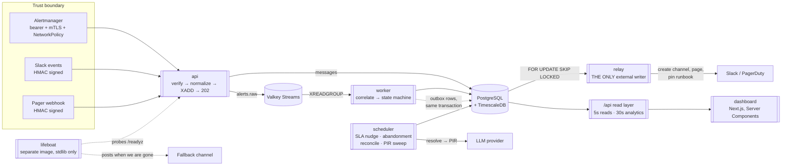
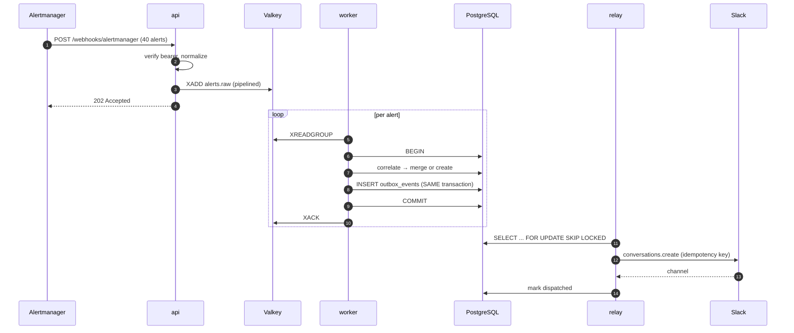
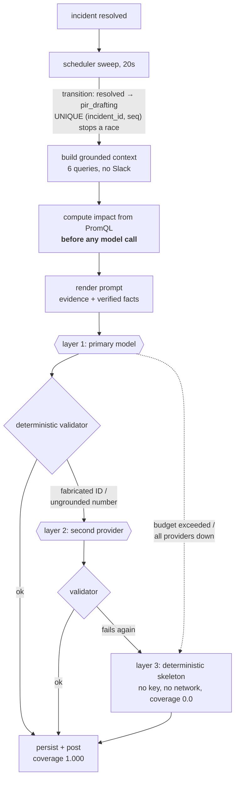
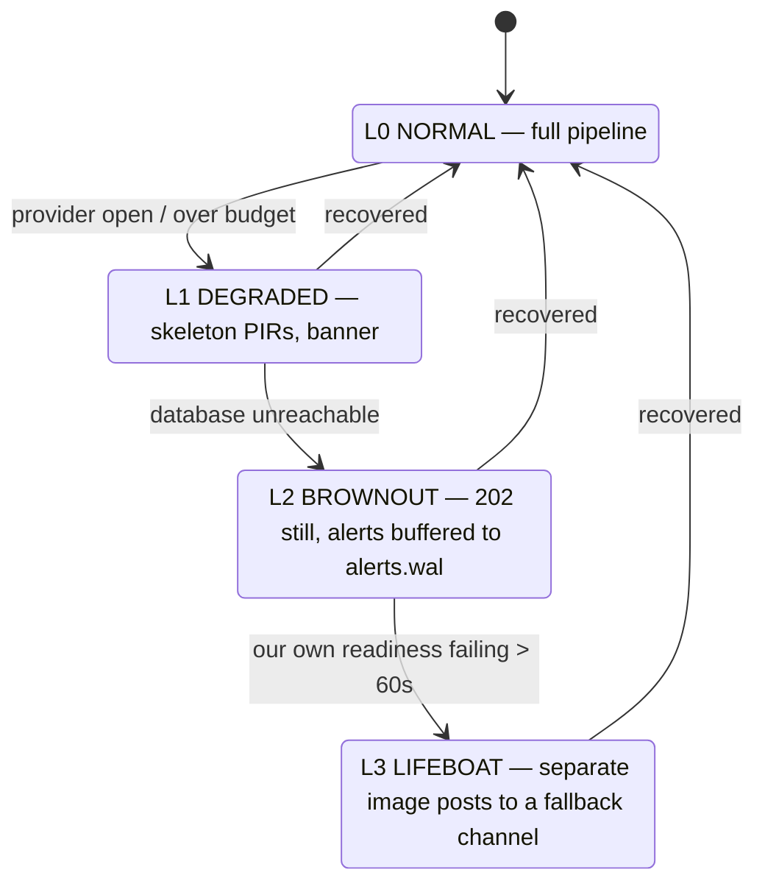

# Architecture

Diagrams are Mermaid, rendered by GitHub. No exported PNGs — a diagram that
lives as an image is a diagram that goes stale the first time somebody changes
the code and cannot regenerate it.

---

## The shape of the system

**Five processes, and the split is the bulkhead.** Ingest is latency-bound with
a 250 ms p99 to hold. Orchestration is CPU-bound on correlation and intent
classification. The relay is the only process permitted to perform an external
write. The scheduler owns the one job that can take sixty seconds and spend
money. Sharing any two of them means a forty-alert storm competes with the
webhook still trying to return 202.

The lifeboat is dotted because it shares nothing with the rest — different
image, standard library only, its own failure domain. If it imported the
application it would fail for the same reason the application failed.

---

## The write path, and why the outbox exists

The transaction boundary at steps 8–11 is the whole design. The state change and
the intent to perform a side effect commit **together**, so there is no window
in which the database believes a channel exists and Slack disagrees. The relay
then retries at least once, and the idempotency key is what makes retrying an
external write safe.

Crash between steps 14 and 16 — after Slack created the channel, before we
recorded it — is crash point 8 of twelve in `test_crash_matrix.py`. On retry the
same key returns the same channel.

---

## The PIR pipeline

**Impact is computed before the model runs**, and `impact` is absent from the
draft schema, so the model cannot be asked for a number. The validator rejects
any number in the draft that is not in the computed set.

The skeleton reports coverage **0.0, not 1.0**. It makes no cited claims, and
recording perfect grounding for it would make the one SLI with a zero error
budget look healthy on exactly the days the feature was unavailable.

---

## Degradation

Every transition is **announced**. Silent degradation is worse than failure: a
product that fails visibly gets worked around, and one that quietly starts
producing less trustworthy output keeps being trusted.

L2 keeps accepting alerts because **a dropped alert is unrecoverable and a
delayed one is not** — that asymmetry is why ingest is the one AP component in
an otherwise CP system.

---

## What is deliberately not here

- **No websockets.** A 15-second revalidation is enough for a handful of
  concurrent incidents. Websockets would be complexity with no payoff, and
  saying so is a better answer than adding them for show.
- **No FK from the hypertables to `incidents`.** FK enforcement across many
  chunks is a chunk-management cost with little payoff; integrity is enforced in
  the application plus a periodic orphan check. A considered trade, not an
  oversight.
- **No `secrets.yaml` in the Helm chart, ever.** A chart that templates Secret
  objects invites a `values-prod.yaml` with real credentials, and that file
  reaches git within about two weeks. Secrets are references to objects created
  out of band; `helm template` with default values emits zero of them, and a CI
  step asserts it.
- **No auto-promotion of the eval baseline.** A gate that promotes its own
  baseline on green ratchets to whatever it last measured and can never detect a
  slow regression.

---

## The invariants, and where each is enforced

| # | Invariant | Enforced by |
|---|---|---|
| INV-01 | `domain/` is pure — no I/O, clock, randomness | `test_domain_purity.py` walks the AST |
| INV-02 | `conversations.history` is never called on the hot path | the fake adapter **raises**; a Prometheus rule watches production |
| INV-03 | Only the relay performs external writes | AST test over every module, one documented exception |
| INV-04 | Nothing correctness-critical lives only in cache | every read has a DB fallback |
| INV-05 | An uncited claim is unrepresentable | `Claim.citations` has `min_length=1` |
| INV-06 | Every number in a PIR was computed, not generated | validator checks against the computed set |
| INV-07 | No model name in code outside `config/` | CI grep + unit test |
| INV-08 | No naked `TIMESTAMP` | schema query returning zero rows |
| INV-09 | `timeline_events` segments by `intent` | compression-ratio test ≥ 8× |
| INV-10 | Replay makes zero network calls | socket guard, asserted per fixture |
| INV-11 | `IncidentPilotDown` does not route through us | `test_alertmanager_config.py` |
| INV-12 | Degradation is announced | `test_degradation_announces` |

Every one of these is a test rather than a paragraph. A paragraph describes
what somebody intended; a test describes what is true this morning.
